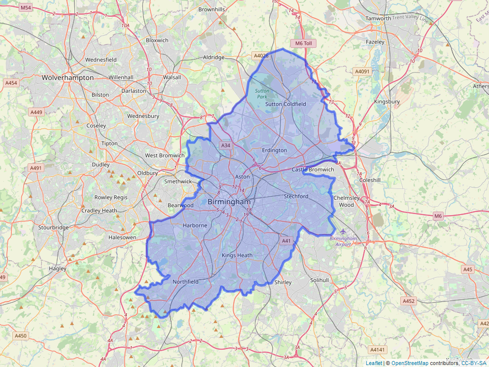

```{r setup, include=FALSE}
knitr::opts_chunk$set(echo = TRUE)
knitr::opts_chunk$set(warning = FALSE)
knitr::opts_chunk$set(message = FALSE)
options(scipen = 5)
options(kableExtra.auto_format = TRUE)

```

```{r include = TRUE, echo = FALSE}
htmltools::img(src = knitr::image_uri("../images/btg_logo.png"),
               alt = 'logo',
               style = 'position: absolute; top:0; right:0; padding-right:10px; padding-top: 10px; height:118px; width:125px')
```

# Overview

This document provides a description of the procedures undertaken to produce the first versions of Black Thrive’s new Shared Measurement System dashboards for Birmingham, Haringey, and Lambeth.

# R packages used

```{r packages, class.source = "fold-show"}
library(tidyverse)
library(kableExtra) # for tables
library(leaflet) # for mapping
library(mapview) # for saving maps
library(gmodels) # for CrossTable
library(epitools) # for riskratio
library(forcats) # for factor reduction
```


# Data

The aim of this analysis was to produce new dashboards for Birmingham, Haringey and Lambeth, using the same set of indicators implemented in the previous iteration of the Lambeth dashboard. It has not yet been possible to acquire data for Birmingham and Haringey relating to the mental health indicators that are included in the Lambeth dashboard (Rate of Section 136 detentions, rate of episodes of physical restraint, and percentage of people with depression prior to starting Talking Therapies). It has also not been possible to acquire more recent data for these indicators for Lambeth. As our relationships with relevant public health authorities develop, we aim to update these dashboards with these and other health-related indicators. The table below lists the indicators included in this version of the dashboards, and the sources of their data. 

```{r echo = FALSE}
sources_df <- data.frame("Indicator" = c("Good level of development",
                                    "Level 4+ GCSE Maths & English",
                                    "Children looked after by local authority",
                                    "16-64 year olds in employment",
                                    "Individuals subject to Stop and Search: Birmingham",
                                    "Individuals subject to Stop and Search: Haringey & Lambeth",
                                    
                                    "Homeless or at risk of becoming homeless",
                                    "Adult population",
                                    "Child population: Birmingham",
                                    "Child population: Haringey & Lambeth",
                                    "Birmingham area coordinates"
                                    ),
                         "Date range" = c("2018-2019 academic year",
                                          "2019-2020 academic year",
                                          "2018-2019 financial year",
                                          "12 months to March 2021",
                                          "12 months to August 2021",
                                          "12 months to August 2021",
                                          "2020-2021 financial year",
                                          "2021",
                                          "2011",
                                          "2019",
                                          ""),
                         "Source" = c("[Early Years Foundation Stage Profile results](https://www.gov.uk/government/statistics/early-years-foundation-stage-profile-results-2018-to-2019)",
                                 "[Key Stage 4 performance](https://explore-education-statistics.service.gov.uk/find-statistics/key-stage-4-performance-revised#dataDownloads-1)",
                                 "[Children looked after in England including adoption](https://www.gov.uk/government/statistics/children-looked-after-in-england-including-adoption-2018-to-2019)",
                                 "[NOMIS Annual Population Survey](https://www.nomisweb.co.uk/datasets/apsnew)",
                                 "[Police API](https://data.police.uk)",
                                 "[Metropolitan Police Stop and Search Dashboard Data](https://data.london.gov.uk/dataset/mps-stop-and-search-public-dashboard-data)",
                                 
                                 "[Live tables on homelessness; Detailed local authority level tables](https://www.gov.uk/government/statistical-data-sets/live-tables-on-homelessness#homelessness-summary-local-authority-level-tables)",
                                 "[Annual Population Survey](https://www.nomisweb.co.uk/datasets/apsnew)",
                                 "[Census 2011](https://www.nomisweb.co.uk/census/2011/dc2101ew)",
                                 "[Greater London Authority Ethnic group population projections](https://data.london.gov.uk/dataset/ethnic-group-population-projections)",
                                 "[MapIt by mySociety](https://mapit.mysociety.org/area/2514.html)")
)
                    

sources_df %>% kable(col.names = c("Indicator", "Date", "Source")) %>%
  kable_styling(full_width = FALSE)
```

Because it has not yet been possible to acquire more recent data for mental health outcomes, the mental health indicators for Lambeth were analysed based on crosstabulations derived from the data collected by Lambeth Public Health in a previous analysis. These indicators are presented in the table below.

```{r}
sources_df <- data.frame("Indicator" = c(
                                    "Individuals subject to detention per Section 136 of the Mental Health Act",
                                    "Individuals moderately to severely depressed prior to starting Talking Therapies",
                                    "Lambeth ward patients physically restrained"
                                    ),
                         "Date" = c(
                                    "2018/19",
                                    "2017/18",
                                    "2017/18"
                                    ),
                    "Source" = c(
                                 "EPJS, South London and Maudsley NHS Foundation Trust",
                                 "IAPTUS, South London and Maudsley NHS Foundation Trust",
                                 "DATIX, South London and Maudsley NHS Foundation Trust"
                                  )
)

sources_df %>% kbl() %>%
  kable_styling(full_width = F)
```


Below, each indicator is briefly described, as well as how it was sourced and structured for the present analysis.

## Children achieving Good Level of Development

This indicator describes the number of children aged 4-5 years old who reach a “Good Level of Development” (GLD), defined as the achievement of expected level of development for Early Learning Goals and literacy and mathematics. 

Data for this indicator were acquired from the *Early Years Foundation Stage Profile results: 2018-2019* produced by the Department for Education. This data provides the number of children reaching GLD and the total number of pupils according to the "ethnic" categories Asian, Black, Chinese, Mixed, and White. Subsets of this dataset were produced for Haringey and Birmingham by filtering the data based on the following criteria:

```{r echo = FALSE}
df <- data.frame("Variable name" = c("la_name","characteristic","time_period"),
                 "Value" = c("Birmingham | Haringey | Lambeth", "Ethnicity","201819"))

df %>% kable(col.names = c("Variable name","Value")) %>% kable_styling(full_width = F)
```

## Pupils achieving at least Level 4 in GCSE Maths and English

Data for the number of pupils achieving at least Level 4 in GCSE Maths and English were acquired from *Key Stage 4 performance 2019/20*, produced by the Department for Education. The variables of interest in this dataset were total number of pupils (*t_pupils*), total number achieving at least Level 4 (*t_l2basics_94*), and percentage achieving at least Level 4 (*pt_l2basics_94*). Subsets of this data were produced for Haringey and Birmingham by filtering the data according to the following criteria:

```{r echo = FALSE}
df <- data.frame("Variable name" = c("la_name","breakdown"),
                 "Value" = c("Birmingham | Haringey | Lambeth", "Ethnic major"))

df %>% kable(col.names = c("Variable name","Value")) %>% kable_styling(full_width = F)
```

## Children looked after by the local authority

This indicator describes the number of children looked after by the local authority. Data were acquired from *Children looked after in England including adoption: 2018 to 2019*, produced by the Department for Education. The following filter was applied to acquire data specific to each of Birmingham, Haringey. and Lambeth:

```{r echo = FALSE}
df <- data.frame("Variable name" = c("geog_n"),
                 "Value" = c("Birmingham | Haringey | Lambeth"))

df %>% kable(col.names = c("Variable name","Value")) %>% kable_styling(full_width = F)
```

The variables of interest in this dataset were *CLA_Black* and *CLA_White*, which correspond to the number of children looked after by the local authority who are Black and White, respectively. In order to calculate the rate at which children were looked after by the local authority, these data were supplemented by child population statistics. For Haringey and Lambeth, child population estimates for 2019 were acquired via the Greater London Authority *Ethnic group population projections*, by filtering according to the following criteria: 

```{r echo = FALSE}
df <- data.frame("Variable name" = c("borough","age","ethnic_group"),
                 "Value" = c("Haringey | Lambeth", "0-17 years old","Black, White"))

df %>% kable(col.names = c("Variable name","Value")) %>% kable_styling(full_width = F)

```

It was not possible to source population projections by ethnicity for Birmingham, so child populations statistics were drawn from the 2011 Census (*Census 2011: DC2101EW*). The data selected from this latter dataset were:

```{r echo = FALSE}
df <- data.frame("Variable name" = c("Geography","Age","Ethnicity","Sex"),
                 "Value" = c("Birmingham", "0-17 years old","Black, White","All"))

df %>% kable(col.names = c("Variable name","Value")) %>% kable_styling(full_width = F)
```

## Employment 

This indicator describes the number of 16-64 year olds in employment. The data for this indicator were acquired from the Office for National Statistics *Annual Population Survey* by querying the data on the NOMIS website. The query parameters used were:

```{r echo = FALSE}
df <- data.frame("Variable name" = c("Geography","Date","Employment rate"),
                 "Value" = c("Birmingham | Haringey | Lambeth", "12 months to March 2021","aged 16-64 employment rate for all Black or Black British, aged 16-64 employment rate - White"))

df %>% kable(col.names = c("Variable name","Value")) %>% kable_styling(full_width = F)
```

This data provides a *numerator*, which is the total number in employment, and a *denominator*, which is the population estimate for the ethnicity.

## Rate of Police Stop and Search {.tabset}

The procedure for Stop and Search data differed by local authority. For Birmingham, the Police API (published by the Single Online Home National Digital Team) was used to query Stop and Search data. To do this, it was first necessary to define the area of Birmingham using latitude and longitude coordinates. Coordinates of the city boundary were acquired from [MapIt by mySociety](https://mapit.mysociety.org/area/2514.html). This provided 3634 coordinate points that define the area of Birmingham, as below: 

```{r read_coords}
# Get coordinates of Birmingham area
file <- jsonify::from_json("../data/birm_geo.json") # read json
coords <- as.data.frame(file[["coordinates"]][[1]]) # make dataframe
colnames(coords) <- c("long","lat") # name cols
coords_for_map <- coords # map wants long, lat
coords <- subset(coords, select = c("lat","long")) # swap columns for API (wants lat, long)
```

```{r include = TRUE, echo = FALSE}
m <- leaflet(as.matrix(coords_for_map)) %>% 
  addPolygons() %>% 
  addTiles()

mapshot(m, file = "../images/map.png")
```




With these coordinates, the R package *httr* and a custom function were used to submit a http POST request to the Police API. The time period queried was the 12 months to the end of August 2021. The function used is provided in the code below. To summarise, it allows the user to specify a date range and a set of coordinates in which to search for Stop and Search data held on the Police API.

```{r area_data, include = TRUE, echo = TRUE}
# Acquire stop and search data in an area for a time period

# area_coords: area of interest. Must be a data frame with column names "lat" and "long" 

# most_recent_month: numeric value specifying most recent month (e.g. 8 for August)

# most_recent_year (YYYY): numeric value specifying most recenet year (e.g. 2021)

# num_months_backwards: number of months backwards for which data are required. 
# Default = 12. For example, if the most recent year of data is required, 
# num_months_backwards would be 12

# If most_recent_month/year is not specified, function will query Police API for
# most recent update and use this as a start point

retrieve_area_data <- function(area_coords, most_recent_month = NULL, most_recent_year = NULL, num_months_backwards = 12){
  output <- data.frame() # initialise dataframe
  
  # make coordinate string for POST request
  coord_string <- c()
  for(i in 1:nrow(area_coords)){
    if(i == 1){
      coord_string <- paste(area_coords[i,"lat"],",",area_coords[i,"long"],sep="")
    }else{
    coord_string <- paste(coord_string,":",area_coords[i,"lat"],",",area_coords[i,"long"],sep="")
  }
  }
  # get most recent update if most_recent data not specified
  if(is.null(most_recent_month) || is.null(most_recent_year)){ 
    date <- httr::content(httr::GET("https://data.police.uk/api/crimes-street-dates"))[[1]][["date"]] # get most recent update
    most_recent_month <- as.numeric(substr(date,6,7))
    most_recent_year <- as.numeric(substr(date,1,4))
  }
  else{
    most_recent_month <- most_recent_month
    most_recent_year <- most_recent_year
  }
  
  # specify formatted date
  for(i in 1:num_months_backwards){
    if(i == 1){ # set values for first iteration
      month_num <- most_recent_month
      year <- most_recent_year
    }
    else{ # subsequent iterations
      month_num <- month_num - 1 # backwards a month each iteration
      if(month_num %% 12 == 0){ # if reach a new year, start months from 12 again
        month_num <- 12
        year <- year - 1 # backwards a year
      }
    }
    if(month_num < 10){ # paste 0 for months lower than 10
      month <- paste("0", month_num, sep = "")
    }
    else{
      month <- month_num
    }
    
  # build query
    date <- paste(year, "-", month, sep = "") # combine dates into format for API
    body <- list("poly" = coord_string,
                 "date" = date)
    post_request <- httr::POST("https://data.police.uk/api/stops-street?", body = body) # POST request
    df <- httr::content(post_request) # get content from response
    df_2 <- data.frame(t(sapply(df,c))) # convert to df
    output <- rbind(output, df_2) # add to dataframe
    print(paste("Working... ", i, " of ", num_months_backwards, " retrieved", sep = ""))
    print(date)
  }
  # unlist remaining listed columns. Not ideal solution; future versions could improve on this.
  output <- output %>%
    unnest_wider(., outcome_object, names_sep = ".") %>%
    unnest_wider(., location, names_sep = ".") %>%
    unnest_wider(., location.street, names_sep = ".")
  output <- as.matrix(output) # make matrix because write.csv runs into problems with list cols
  return(output)
}

# request made for the present data:
# data <- retrieve_area_data(coords, 8, 2021, 12) 
```

```{r include = TRUE, echo = FALSE}
data <- read.csv("../data/birmingham_stop_search_2020_09_2021_08.csv")

# officer-defined ethnicity
appearance_freq_data <- data %>%
  group_by(officer_defined_ethnicity) %>%
  summarise(
    n = n() # count frequencies
  ) %>%
  mutate(
    percentage = round(100 * (n / sum(n)),2) # calculate percentages
  )

#  self-defined ethnicity
self_defined_freq_data <- data %>%
  group_by(self_defined_ethnicity) %>%
  summarise(
    n = n() # count frequencies
  ) %>%
  mutate(
    percentage = round(100 * (n / sum(n)),2) # calculate percentages
  )

self_perc_recorded <- 100 - self_defined_freq_data$percentage[which(self_defined_freq_data$self_defined_ethnicity == "NULL")]
```

It was not appropriate to use officer-defined ethnicity (variable name *officer_defined_ethnicity*) for the Birmingham dataset because for `r round(appearance_freq_data$percentage[which(appearance_freq_data$officer_defined_ethnicity == "NULL")],2)`% of records this data was not reported (see the tables below). In contrast, self-defined ethnicity (*self_defined_ethnicity*) was reported for `r round(self_perc_recorded,2)`% of records, so this variable was used as the ethnicity variable in the present analysis. Ethnicity was aggregated into the broad categories of Black and White for consistency with the other indicators presented in this report.

### Officer-defined ethnicity count

```{r include = TRUE, echo = FALSE}
appearance_freq_data %>% kbl(col.names = c("Officer-defined ethnicity", "Count", "Percentage")) %>% kable_styling(full_width = F)
```

### Self-defined ethnicity count

```{r echo = FALSE}
self_defined_freq_data %>% kbl(col.names = c("Self-defined ethnicity", "Count","Percentage")) %>% kable_styling(full_width = F)
```

```{r include = TRUE, echo = FALSE}
data <- read.csv("../data/haringey_stop_and_search_2020_2021_v2.csv")
haringey_appearance_freq_data <- data %>%
  group_by(Ethnic.Appearance.Code) %>%
  summarise(
    n = n() # count frequencies
  ) %>%
  mutate(
    percentage = round(100 * (n / sum(n)), 2)
  )
haringey_appearance_freq_data$Ethnic.Appearance.Code[1] <- "NULL"
haringey_ethnicity_recorded <- 100 - sum(appearance_freq_data$percentage[1:2])
```

```{r}
# stop and search
lambeth_data <- read.csv("../data/Stops_LDS_Extract_12MonthsToEnd_202108.csv")

lambeth_data <- subset(lambeth_data, Borough.of.Stop == "Lambeth") # subset to Lambeth

# officer-defined ethnicity
lambeth_appearance_freq_data <- lambeth_data %>%
  group_by(Ethnic.Appearance.Code) %>%
  summarise(
    n = n() # count frequencies
  ) %>%
  mutate(
    percentage = round(100 * (n / sum(n)), 2)
  )

lambeth_appearance_freq_data$Ethnic.Appearance.Code[1] <- "NULL"
lambeth_ethnicity_recorded <- 100 - sum(lambeth_appearance_freq_data$percentage[1:2])
```

## {.unlisted .unnumbered}

For Haringey and Lambeth, Stop and Search data were acquired via the Metropolitan Police Stop and Search Dashboard (published by the Metropolitan Police Service) by filtering the dataset by the variable *Borough of Stop*. The time period this data covered was the 12 months to the end of August 2021. The completeness of the officer-defined ethnicity variable (*Ethnic.Appearance.Code*) in the Haringey and Lambeth data sets was better than for Birmingham; in Haringey `r haringey_ethnicity_recorded`% of stops recorded officer-defined ethnicity, and in Lambeth `r lambeth_ethnicity_recorded`% of stops recorded officer-defined ethnicity. It was therefore technically possible to use officer-defined ethnicity as the ethnicity variable in the Haringey and Lambeth analyses. However, for purposes of comparison with the Birmingham statistics, self-defined ethnicity (again aggregated into broad categories; variable name *SDE.Group*) was used in analyses for Haringey and Lambeth. The tables below show the counts and percentages for officer- and self-defined ethnicity in Haringey and Lambeth.

### Haringey {.unlisted .unnumbered .tabset}

#### Officer-defined ethnicity 

```{r include = TRUE, echo = FALSE}
haringey_appearance_freq_data %>% kbl(col.names = c("Officer-defined ethnicity", "Count", "Percentage")) %>% kable_styling(full_width = F)
```

#### Self-defined ethnicity 

```{r}
# get codes
code_df <- data.frame(code = c("A1",
                               "A2",
                               "A3",
                               "A9",
                               "B1",
                               "B2",
                               "B9",
                               "M1",
                               "M2",
                               "M3",
                               "M9",
                               "O1",
                               "O9",
                               "W1",
                               "W2",
                               "W9",
                               "N1",
                               "N2",
                               "N3",
                               "N4"
                               ),
                      description = c("Indian",
                                      "Pakistani",
                                      "Bangladeshi",
                                      "Any other Asian background",
                                      "Black Caribbean",
                                      "Black African",
                                      "Any other Black background",
                                      "White and Black Caribbean",
                                      "White and Black African",
                                      "White and Asian",
                                      "Any other mixed background",
                                      "Chinese",
                                      "Any other ethnic group",
                                      "White British",
                                      "White Irish",
                                      "Any other White background",
                                      "The officer's presence is urgently required elsewhere",
                                      "The situation involves public disorder",
                                      "The person did not understand what is required",
                                      "The person declined to define their ethnicity"
                      )
)

  
data$ethnicity_code <- substr(data$Self.defined.Ethnicity.Code, 1,2)
for(i in 1:nrow(data)){
  for(j in 1:nrow(code_df)){
    if(data$ethnicity_code[i] == code_df$code[j]){
      data$self_defined_new[i] = code_df$description[j]
    }
  }
}
```

```{r include = TRUE, echo = FALSE}
self_defined_freq_data <- data %>%
  group_by(self_defined_new) %>%
  summarise(
    n = n() # count frequencies
  ) %>%
  mutate(
    percentage = round(100 * (n / sum(n)), 2)
  )

self_defined_freq_data$self_defined_new[1] <- "NULL"
self_defined_freq_data %>% kbl(col.names = c("Self-defined ethnicity", "Count", "Percentage")) %>% kable_styling(full_width = F)
```
### Lambeth {.unlisted .unnumbered .tabset}

#### Officer-defined ethnicity

```{r include = TRUE, echo = FALSE}
lambeth_appearance_freq_data %>% kbl(col.names = c("Officer-defined ethnicity", "Count", "Percentage")) %>% kable_styling(full_width = F)
```

#### Self-defined ethnicity

```{r}
# get codes
code_df <- data.frame(code = c("A1",
                               "A2",
                               "A3",
                               "A9",
                               "B1",
                               "B2",
                               "B9",
                               "M1",
                               "M2",
                               "M3",
                               "M9",
                               "O1",
                               "O9",
                               "W1",
                               "W2",
                               "W9",
                               "N1",
                               "N2",
                               "N3",
                               "N4"
                               ),
                      description = c("Indian",
                                      "Pakistani",
                                      "Bangladeshi",
                                      "Any other Asian background",
                                      "Black Caribbean",
                                      "Black African",
                                      "Any other Black background",
                                      "White and Black Caribbean",
                                      "White and Black African",
                                      "White and Asian",
                                      "Any other mixed background",
                                      "Chinese",
                                      "Any other ethnic group",
                                      "White British",
                                      "White Irish",
                                      "Any other White background",
                                      "The officer's presence is urgently required elsewhere",
                                      "The situation involves public disorder",
                                      "The person did not understand what is required",
                                      "The person declined to define their ethnicity"
                      )
)

  
lambeth_data$ethnicity_code <- substr(lambeth_data$Self.defined.Ethnicity.Code, 1,2)
for(i in 1:nrow(data)){
  for(j in 1:nrow(code_df)){
    if(lambeth_data$ethnicity_code[i] == code_df$code[j]){
      lambeth_data$self_defined_new[i] = code_df$description[j]
    }
  }
}
```

```{r include = TRUE, echo = FALSE}
lambeth_self_defined_freq_data <- lambeth_data %>%
  group_by(self_defined_new) %>%
  summarise(
    n = n() # count frequencies
  ) %>%
  mutate(
    percentage = round(100 * (n / sum(n)), 2)
  )

lambeth_self_defined_freq_data$self_defined_new[1] <- "NULL"
lambeth_self_defined_freq_data %>% kbl(col.names = c("Self-defined ethnicity", "Count", "Percentage")) %>% kable_styling(full_width = F)
```

## {.unlisted .unnumbered}

All Stop and Search data were supplemented by population estimates data for Haringey and Birmingham from the 2021 *Annual Population Survey*.

## Households that are statutorily homeless or at risk of becoming homeless

This indicator describes the number of households that are owed prevention or relief duty, meaning that they are statutorily homeless or at risk of being so. The data were acquired from *Live tables on homelessness; Detailed authority level tables: Financial year 2020-21*, produced by the Department for Levelling Up, Housing, and Communities). The subset used for the current analysis is *Table A8: Ethnicity of main applicants assessed as owed a prevention or relief duty by local authority 2020-21 financial year*. From this table, data were selected corresponding to the Black and White populations of Haringey and Birmingham.

# Analysis and Results

Chi-square and Fisher exact tests were used to analyse the data. For each indicator, a crosstabulation was created containing the frequency of Black and White individuals for which the indicator outcome was true and the frequency for which it was false. This crosstabulation was then used to test whether the odds of the indicator outcome were significantly different for the Black population compared to the White population. This was done using  the *CrossTable* function from the *gmodels* package in R. This function provides statistics for the Chi-square and Fisher exact tests as well an estimate of the odds ratio and its confidence interval. 

A further step was taken to produce relative risk ratios for the public-facing dashboards. Relative risk ratios tend to be more intuitive to interpret for non-statisticians because the value presents relative increases or decreases in the *likelihood* of an outcome rather than in the *odds* of an outcome. Although odds ratios tend to approximate relative risk ratios when an outcome is uncommon (< 10%) in the comparator group (i.e., the White population), when the outcome is common (> 10%) in the comparator group  odds ratios tend to exaggerate relative risk ratios [@davies_when_1998]. Relative risk ratios were calculated using the *riskratio* function from the *epitools* package in a custom function. This function restructures the data for each indicator in the format required for *riskratio* and then produces a relative risk ratio and its 95% confidence interval.

```{r include = TRUE, echo = TRUE}
rr_from_df <- function(df, name){
  # function takes dfs made earlier, transforms in matrices, and creates risk
  # ratios and associated confidence intervals
  # 'name' is the name of the indicator
  mat <- matrix(c(df[2,2],
                  df[2,1],
                  df[1,2],
                  df[1,1]), 2, 2)
  df_out <- data.frame("indicator" = name,
                     "rr" = riskratio(mat)[["measure"]][2,1],
                     "ci_low" = riskratio(mat)[["measure"]][2,2],
                     "ci_upp" = riskratio(mat)[["measure"]][2,3])
  return(df_out)
}
```

The results of this procedure for Birmingham, Haringey, and Lambeth are presented below. For each indicator, the code for preparing and analysing the data is provided, followed by a written report of the findings.

## Birmingham

```{r gld_analysis, include = FALSE}
## good development
data <- read.csv("../data/birmingham_good_development_2018_2019_v2.csv")

total_data <- data %>%
  subset(gender == "Total") %>%
  subset(ethnicity != "Total")

row.names(total_data) <- total_data$ethnicity # set row names for indexing

# prepare data frame for crosstabs

black <- data.frame("black" = c("gld_number" = total_data["Black", "gld_number"], "not_gld_number" = total_data["Black", "number_of_pupils"] - total_data["Black", "gld_number"]))

white <- data.frame("white" = c("gld_number" = total_data["White", "gld_number"], "not_gld_number" = total_data["White", "number_of_pupils"] - total_data["White", "gld_number"]))

bw_mat <- as.matrix(cbind(black, white)) # combine black and white into one matrix
gld_df <- as.data.frame(bw_mat) # save df

rr <- rr_from_df(gld_df, "Good Level of Development at age 5 (2018-2019)") # get risk ratio
xtab <- CrossTable(bw_mat, fisher = T, chisq = T, expected = T) # save xtab

xtab_gld <- xtab # save for later
rr_gld <- rr
```


```{r gcse_analysis,include = FALSE}
data <- read.csv("../data/birmingham_4_plus_gcse_2019_2020_v2.csv")

# subset and rename
total_data <- data %>%
  subset(gender == "Total") %>%
  subset(ethnicity == "BLACK" | ethnicity == "WHITE") %>%
  rename(total_4_plus = t_l2basics_94,
         percent_4_plus = pt_l2basics_94)

# rename ethnicity levels and row names
total_data$ethnicity <- as.factor(total_data$ethnicity)
levels(total_data$ethnicity) <- c("Black","White")
row.names(total_data) <- total_data$ethnicity

total_data <- total_data[,-c(1)] # remove unnecessary column

# calculate number who didn't achieve level 4 plus
total_data <- total_data %>%
  mutate(
    not_gcse = t_pupils - total_4_plus
  )

# prepare data frame for xtab
black <- data.frame("black" = c("gcse" = total_data["Black", "total_4_plus"], "not_gcse" = total_data["Black", "not_gcse"]))
white <- data.frame("white" = c("gcse" = total_data["White", "total_4_plus"], "not_gcse" = total_data["White", "not_gcse"]))
bw_mat <- as.matrix(cbind(black, white))
gcse_df <- as.data.frame(bw_mat) # save df

# run stats
rr <- rr_from_df(gcse_df, "Level 4+ GCSE Maths & English (2018-2019)") # get risk ratio
xtab <- CrossTable(bw_mat, fisher = T, chisq = T, expected = T)
xtab_gcse <- xtab # save for later
rr_gcse <- rr
```


```{r cla_analysis, include = FALSE}
# children looked after
data <- read.csv("../data/birmingham_cla_2018_2019_v2.csv")

# prepare data for analysis
total_data <- data %>%
  subset(ethnicity != "Total") %>%
  mutate(
    not_cla = pop - cla,
    percentage = as.numeric(percentage)
  )

total_data <- total_data[1:nrow(total_data) - 1,] # drop unknown
row.names(total_data) <- total_data$ethnicity

# prepare xtab
black <- data.frame("black" = c("cla" = total_data["Black", "cla"], "not_cla" = total_data["Black", "not_cla"]))
white <- data.frame("white" = c("cla" = total_data["White", "cla"], "not_cla" = total_data["White", "not_cla"]))
bw_mat <- as.matrix(cbind(black, white))
cla_df <- as.data.frame(bw_mat) # save df

# run analysis
rr <- rr_from_df(cla_df, "Children looked after by local authority (2018-2019)") # risk ratio
xtab <- CrossTable(bw_mat, fisher = T, chisq = T, expected = T)
xtab_cla <- xtab # save for later
rr_cla <- rr
```

```{r employment_analysis, include = FALSE}
# employment
data <- read.csv("../data/birmingham_employment_rate_2020_2021_v2.csv")

# subset and organise data
total_data <- data %>%
  subset(gender == "all") %>%
  mutate(
    percentage = as.numeric(percentage),
    numerator = as.numeric(numerator),
    denominator = as.numeric(denominator),
    not_in_employment = denominator - numerator,
  )
  
row.names(total_data) <- total_data$ethnicity

# prepare xtab
black <- data.frame("black" = c("employed" = total_data["black", "numerator"], "not_employed" = total_data["black", "not_in_employment"]))
white <- data.frame("white" = c("employed" = total_data["white", "numerator"], "not_employed" = total_data["white", "not_in_employment"]))
bw_mat <- as.matrix(cbind(black, white))

employment_df <- as.data.frame(bw_mat) # save df

rr <- rr_from_df(employment_df, "Employment rate (2020-2021)") # risk ratio

# run analysis
xtab <- CrossTable(bw_mat, fisher = T, chisq = T, expected = T)
#chisq.test(bw_mat) double check result with chisq.test function
xtab_employment <- xtab # save for later
rr_employment <- rr
```


```{r stop_search_analysis, include = FALSE}
# stop and search
data <- read.csv("../data/birmingham_stop_search_2020_09_2021_08.csv")

data$self_defined_ethnicity <- as.factor(data$self_defined_ethnicity)

# subset to just Black and White 
data <- subset(data, 
               self_defined_ethnicity == "Black/African/Caribbean/Black British - African" |
                 self_defined_ethnicity == "Black/African/Caribbean/Black British - Any other Black/African/Caribbean background"|
                 self_defined_ethnicity == "Black/African/Caribbean/Black British - Caribbean"|
                 self_defined_ethnicity == "White - Any other White background" |                                                 
                 self_defined_ethnicity == "White - English/Welsh/Scottish/Northern Irish/British" |                               
                 self_defined_ethnicity == "White - Irish")

data$self_defined_ethnicity_2 <- fct_collapse(data$self_defined_ethnicity,
                                              Black = c("Black/African/Caribbean/Black British - African",
                                                        "Black/African/Caribbean/Black British - Any other Black/African/Caribbean background",
                                                        "Black/African/Caribbean/Black British - Caribbean"),
                                              White = c("White - Any other White background",
                                              "White - English/Welsh/Scottish/Northern Irish/British",
                                              "White - Irish")
)

# officer-defined ethnicity
self_defined_freq_data <- data %>%
  group_by(self_defined_ethnicity_2) %>%
  summarise(
    n = n() # count frequencies
  ) %>%
  rename(
    ethnicity = self_defined_ethnicity_2
  )


# add population estimates
# population estimates taken from APS apr2020-mar2021 
# Asian population = sum of Indian and Pakistani/Bangladeshi pops
population_stats <- data.frame("ethnicity" = c("Black", "White"),
                               "pop" = c(97100, 509700))

self_defined_freq_data <- self_defined_freq_data %>%
  merge(., population_stats, by = "ethnicity") %>%
  mutate(
    percentage = 100 * (n/pop),
    not_ss = pop - n
    )

row.names(self_defined_freq_data) <- self_defined_freq_data$ethnicity


# prepare xtabs
black <- data.frame("Black" = c("ss" = self_defined_freq_data["Black", "n"], "not_ss" = self_defined_freq_data["Black", "not_ss"]))
white <- data.frame("White" = c("ss" = self_defined_freq_data["White", "n"], "not_ss" = self_defined_freq_data["White", "not_ss"]))
bw_mat <- as.matrix(cbind(black, white))

stop_search_df <- as.data.frame(bw_mat) # save df
rr <- rr_from_df(stop_search_df, "Police Stop and Search (2020-2021)") # risk ratio

# run analysis
xtab <- CrossTable(bw_mat, fisher = T, chisq = T, expected = T)
xtab_stop_search <- xtab # save for later
rr_stop_search <- rr
```

```{r homeless_analysis, include = FALSE}
# homelessness
data <- read.csv("../data/birmingham_stat_homeless_2020_2021_v2.csv")

total_data <- data %>%
  subset(ethnicity == "Asian" | ethnicity == "Black" | ethnicity == "Mixed/multiple" | ethnicity == "Other" | ethnicity == "White")

total_data <- total_data[,-c(4)]
total_data <- total_data[order(total_data$ethnicity),]
total_data$ethnicity <- as.factor(total_data$ethnicity)
total_data$number_homeless <- as.numeric(total_data$number_homeless)
row.names(total_data) <- total_data$ethnicity


# in homelessness dataset Chinese is included in Asian
# in population dataset it isn't. Need to account for this by taking chinese
# from asian category and adding them to other category
total_data["Asian","number_homeless"] <- total_data["Asian","number_homeless"] - 2
total_data["Other", "number_homeless"] <- total_data["Other", "number_homeless"] + 2

total_data <- total_data %>%
    mutate(
    percentage = 100*(number_homeless/population),
    number_not_homeless = population - number_homeless
    )

# prepare xtab
black <- data.frame("black" = c("homeless" = total_data["Black", "number_homeless"], "not_homeless" = total_data["Black", "number_not_homeless"]))
white <- data.frame("white" = c("homeless" = total_data["White", "number_homeless"], "not_homeless" = total_data["White", "number_not_homeless"]))
bw_mat <- as.matrix(cbind(black, white))

homeless_df <- as.data.frame(bw_mat) # save df
rr <- rr_from_df(homeless_df, "Statutorily homeless or at risk (2020-2021)") # risk ratio

# run analysis
xtab <- CrossTable(bw_mat, fisher = T, chisq = T, expected = T)
xtab_homelessness <- xtab # save for later
rr_homeless <- rr
```

### Summary {.tabset}

```{r include = TRUE, echo = FALSE}
df <- data.frame("indicator" = c("Employment rate (2020-2021)", 
                                 "Level 4+ GCSE Maths & English (2019-2020)", 
                                 "Good Level of Development at age 5 (2018-2019)",
                                 "Statutorily homeless or at risk (2020-2021)",
                                 "Police Stop and Search (2020-2021)",
                                 "Children looked after by local authority (2018-2019)"),
                 "OR" = c(
                   xtab_employment[["fisher.ts"]][["estimate"]][[1]],
                   xtab_gcse[["fisher.ts"]][["estimate"]][[1]],
                   xtab_gld[["fisher.ts"]][["estimate"]][[1]],
                   xtab_homelessness[["fisher.ts"]][["estimate"]][[1]],
                   xtab_stop_search[["fisher.ts"]][["estimate"]][[1]],
                   xtab_cla[["fisher.ts"]][["estimate"]][[1]]
                 ),
                 "ci_low" = c(
                   xtab_employment[["fisher.ts"]][["conf.int"]][[1]], 
                   xtab_gcse[["fisher.ts"]][["conf.int"]][[1]], 
                   xtab_gld[["fisher.ts"]][["conf.int"]][[1]], 
                   xtab_homelessness[["fisher.ts"]][["conf.int"]][[1]], 
                   xtab_stop_search[["fisher.ts"]][["conf.int"]][[1]],
                   xtab_cla[["fisher.ts"]][["conf.int"]][[1]]
                 ),
                 "ci_upp" = c(
                   xtab_employment[["fisher.ts"]][["conf.int"]][[2]],
                   xtab_gcse[["fisher.ts"]][["conf.int"]][[2]],
                   xtab_gld[["fisher.ts"]][["conf.int"]][[2]],
                   xtab_homelessness[["fisher.ts"]][["conf.int"]][[2]],
                   xtab_stop_search[["fisher.ts"]][["conf.int"]][[2]],
                   xtab_cla[["fisher.ts"]][["conf.int"]][[2]]
                 ),
                 "short_name" = c("employment",
                                  "gcse",
                                  "gld",
                                  "homeless",
                                  "stop_search",
                                  "cla")
)

rr_df <- rbind(rr_gld,
               rr_gcse,
               rr_employment,
               rr_homeless,
               rr_stop_search,
               rr_cla)
rr_df$short_name <- c("gld",
                      "gcse",
                      "employment",
                      "homeless",
                      "stop_search",
                      "cla")
```

The analyses presented highlight four areas where the Black population of Birmingham experience worse outcomes than the White population. 
The odds of being employed for Black people are `r round(df$OR[which(df$short_name == "employment")],2)` times the odds for White people, meaning that Black people are `r round(100 * (1 - rr_df$rr[which(rr_df$short_name == "employment")]), 2)`% less likely than White people to be in employment. The odds of Black pupils achieving at least Level 4 in GCSE Maths and English are `r round(df$OR[which(df$short_name == "gcse")],2)` times the odds for White pupils, meaning that Black pupils are `r round(100 * (1 - rr_df$rr[which(rr_df$short_name == "gcse")]), 2)`% less likely than White pupils to achieve at least Level 4 in GCSE Maths and English. The odds of a Black individual being subject to Police Stop and Search are `r round(df$OR[which(df$short_name == "stop_search")],2)` times greater than the odds for a White individual, meaning that Black individuals are `r round(100 * rr_df$rr[which(rr_df$short_name == "stop_search")],0) - 100`% (i.e., `r round(rr_df$rr[which(rr_df$short_name == "stop_search")], 2)` times) more likely than White individuals to be stopped and searched by Police. The odds of Black households being statutorily homeless or at risk of becoming homeless are `r round(df$OR[which(df$short_name == "homeless")],2)` times greater than the odds for a White households, meaning that White households are `r round(100 * rr_df$rr[which(rr_df$short_name == "homeless")],0) - 100`% (i.e., `r round(rr_df$rr[which(rr_df$short_name == "homeless")], 2)` times) more likely than White households to be homeless or at risk of becoming homeless. Finally, there appears to be no difference between Black and White children in the odds of being looked after by the local authority or of achieving a Good Level of Development at age 5.

The figures and tables below visualise these results both in terms of odds ratios and relative risk ratios.

#### Relative risk ratios

```{r rr_plot, include = TRUE, echo = FALSE}
# test rescaling below 1, hrrizontal orientation , without caption
bt_orange <- "#ff9000"
rr_df_2 <- rr_df

rr_df_2$original_rr <- rr_df_2$rr # keep original rr values

rr_df_2 <- rr_df_2[order(rr_df_2$rr),] # order df from lowest to highest
rr_df_2$indicator <- fct_inorder(rr_df_2$indicator) # put levels in order they appear in df

reduction_factor <- ceiling(max(rr_df_2$ci_upp)) # set reduction factor
for(i in 1:nrow(rr_df_2)){
  if(rr_df_2$rr[i] < 1){ # expand values below 1
    rr_df_2$rr[i] <- reduction_factor * (0 - (1 - rr_df_2$rr[i]))
    rr_df_2$ci_low[i] <- reduction_factor * (0 - (1 - rr_df_2$ci_low[i]))
    rr_df_2$ci_upp[i] <- reduction_factor * (0 - (1 - rr_df_2$ci_upp[i]))
  }
  else{ # transform values above one
      rr_df_2$rr[i] <- rr_df_2$rr[i] - 1 
    rr_df_2$ci_low[i] <- rr_df_2$ci_low[i] - 1
    rr_df_2$ci_upp[i] <- rr_df_2$ci_upp[i] - 1
  }
}

#tiff("../images/test_high.tiff", units = "in", width = 10, height = 6, res = resolution)
ggplot(rr_df_2, aes(indicator, rr)) +
  geom_hline(yintercept = 0, colour = bt_orange, size = 1) +
  geom_point(size = 2) +
  geom_errorbar(aes(ymin = ci_low, ymax = ci_upp), width = 0.2) +
  scale_y_continuous(expand = c(0, 0), limits = c(reduction_factor * -1, reduction_factor), breaks = c((reduction_factor * -1) * 0.9, 0.5 * reduction_factor - reduction_factor, 0.75 * reduction_factor - reduction_factor, 0, 1, 2), labels = c(
    "0.1x",
    "0.5x",
    "0.75x",
    "1x",
    "2x",
    "3x")) +
  expand_limits(x = c(0,nrow(rr_df) + 2)) + # for expanding discrete scale
  ylab("Likelihood of outcome compared to White ethnicity") +
  coord_flip() +
  theme_bw() +
  theme(
    panel.grid.minor.y = element_blank(),
    panel.grid.minor.x = element_blank(),
    panel.grid.major.y = element_blank(),
    panel.grid.major.x = element_blank(),
    axis.title.x = element_text(colour = "black", size = 10),
    axis.title.y = element_blank(),
    #axis.text.x = element_text(angle = 90, vjust = 0.5, hjust = 1),
    panel.background = element_rect(fill = "white"),
    plot.background = element_rect(fill = "white"),
    text = element_text(family = "archivo", size = 12),
    axis.text = element_text(family = "archivo", colour = "black"),
    plot.caption = element_text(face = "italic"),
    plot.title = element_text(size = 10)
  ) +
  annotate("segment", x = nrow(rr_df) + 1, xend = nrow(rr_df) + 1, y = reduction_factor/30, yend = reduction_factor * 0.9, arrow = arrow(angle = 45), size = 1) +
  geom_text(x = nrow(rr_df) + 1.5, y = reduction_factor*.9 - (reduction_factor*0.1), label = "More likely", colour = "black", size = 3.5, hjust = 1) +
  annotate("segment", x = nrow(rr_df) + 1, xend =  nrow(rr_df) + 1, y = (reduction_factor/-30), yend = -1*reduction_factor*0.9, arrow = arrow(angle = 45), size = 1) +
  geom_text(x = nrow(rr_df) + 1.5, y = -1*reduction_factor*0.9 + (reduction_factor*0.1), label = "Less likely", colour = "black", size = 3.5, hjust = 0) +
  #geom_text(size = 3, nudge_x = -0.3, nudge_y = 0, aes(x = indicator,label = paste("rr =", round(original_rr, 2)),hjust = 0)) +
  geom_text(size = 3, nudge_x = -0.35, nudge_y = 0, aes(x = indicator,label = paste(round(original_rr, 2),"x", sep=""),hjust = 0.5)) +
  ggtitle("The likelihood of outcomes for the Black population \ncompared to the White population") +
  labs(caption = "Note. Numbers represent the relative risk ratio")
#dev.off()
#ggsave(filename = "../images/rr_plot.png", width = 10, height = 6)
```

```{r include = TRUE, echo = FALSE}
# table with rrS and CIS

rr_df_3 <- rr_df[,-c(ncol(rr_df))] %>%
  mutate(
    rr = round(rr, 2),
    ci_low = round(ci_low, 2),
    ci_upp = round(ci_upp, 2)
  )
rr_df_3 <- rr_df_3[order(-c(rr_df_3$rr)),]

rr_df_3 %>% kable("html", 
                  escape = F, 
                  row.names = F, col.names = linebreak(c("Indicator", "Relative risk ratio", "Lower confidence<br>interval (95%)", "Upper confidence<br>interval (95%)")), caption = "Relative risk ratios and confidence intervals corresponding to the above plot") %>% kable_styling(full_width = F)

```

#### Odds ratios

```{r include = TRUE, echo = FALSE}
# better plot, test rescaling below 1, horizontal orientation , without caption
df_2 <- df

df_2$original_OR <- df_2$OR # keep original OR values

df_2 <- df_2[order(df_2$OR),] # order df from lowest to highest
df_2$indicator <- fct_inorder(df_2$indicator) # put levels in order they appear in df

reduction_factor <- 3 # set reduction factor
for(i in 1:nrow(df_2)){
  if(df_2$OR[i] < 1){ # expand values below 1
    df_2$OR[i] <- reduction_factor * (0 - (1 - df_2$OR[i]))
    df_2$ci_low[i] <- reduction_factor * (0 - (1 - df_2$ci_low[i]))
    df_2$ci_upp[i] <- reduction_factor * (0 - (1 - df_2$ci_upp[i]))
  }
  else{ # transform values above one
      df_2$OR[i] <- df_2$OR[i] - 1 
    df_2$ci_low[i] <- df_2$ci_low[i] - 1
    df_2$ci_upp[i] <- df_2$ci_upp[i] - 1
  }
}

ggplot(df_2, aes(indicator, OR)) +
  geom_hline(yintercept = 0, colour = "#ff9000", size = 1) +
  geom_point(size = 2) +
  geom_errorbar(aes(ymin = ci_low, ymax = ci_upp), width = 0.2) +
  scale_y_continuous(expand = c(0, 0), limits = c(reduction_factor * -1, reduction_factor), breaks = c(-reduction_factor, 0.25 * reduction_factor - reduction_factor, 0.5 * reduction_factor - reduction_factor, 0.75 * reduction_factor - reduction_factor, 0, 1, 2), labels = c(
    "0",
    "0.25",
    "0.5",
    "0.75",
    "1",
    "2",
    "3")) +
  #expand_limits(x = c(0,8)) + # for expanding discrete scale
  ylab("Odds ratio") +
  coord_flip() +
  theme_bw() +
  theme(
    panel.grid.minor.y = element_blank(),
    panel.grid.minor.x = element_blank(),
    panel.grid.major.y = element_blank(),
    panel.grid.major.x = element_blank(),
    axis.title.x = element_text(colour = "black"),
    axis.title.y = element_blank(),
    #axis.text.x = element_text(angle = 90, vjust = 0.5, hjust = 1),
    panel.background = element_rect(fill = "white"),
    plot.background = element_rect(fill = "white"),
    text = element_text(family = "archivo", size = 12),
    axis.text = element_text(family = "archivo", colour = "black"),
    plot.caption = element_text(face = "italic"),
    plot.title = element_text(size = 12)
  ) +
  # annotate("segment", x = nrow(df) + 1, xend = nrow(df) + 1, y = 0.1, yend = reduction_factor * 0.9, arrow = arrow(angle = 45), size = 1) +
  # geom_text(x = nrow(df) + 1.5, y = reduction_factor*.9 - .3, label = "More likely", colour = "black", size = 3.5, hjust = 1) +
  # annotate("segment", x = 7, xend = 7, y = -0.1, yend = -1*reduction_factor*0.9, arrow = arrow(angle = 45), size = 1) +
  # geom_text(x = nrow(df) + 1.5, y = -1*reduction_factor*0.9 +.3, label = "Less likely", colour = "black", size = 3.5, hjust = 0) +
  #geom_text(size = 3, nudge_x = -0.3, nudge_y = 0, aes(x = indicator,label = paste("OR =", round(original_OR, 2)),hjust = 0)) +
  geom_text(size = 3, nudge_x = -0.35, nudge_y = 0, aes(x = indicator,label = paste(round(original_OR, 2),"x", sep=""),hjust = 0.5)) +
  ggtitle("The odds of outcomes for the Black population \ncompared to the White population") +
  labs(caption = "Error bars represent the 95% confidence interval")
```

```{r include = TRUE, echo = FALSE}
# table with ORS and CIS

df_3 <- df[,-c(ncol(df))] %>%
  mutate(
    OR = round(OR, 2),
    ci_low = round(ci_low, 2),
    ci_upp = round(ci_upp, 2)
  )
df_3 <- df_3[order(-c(df_3$OR)),]

df_3 %>% kable(escape = F, row.names = F, col.names = linebreak(c("Indicator", "Odds Ratio", "Lower confidence<br>interval (95%)", "Upper confidence<br>interval (95%)")), caption = "Odds ratios and confidence intervals corresponding to the above plot") %>% kable_styling(full_width = F)
```

Below, the results for each indicator are reported in detail. 

### Children achieving Good Level of Development

```{r}
## good development
data <- read.csv("../data/birmingham_good_development_2018_2019_v2.csv")

total_data <- data %>%
  subset(gender == "Total") %>%
  subset(ethnicity != "Total")

row.names(total_data) <- total_data$ethnicity # set row names for indexing

# prepare data frame for crosstabs

black <- data.frame("black" = c("gld_number" = total_data["Black", "gld_number"], "not_gld_number" = total_data["Black", "number_of_pupils"] - total_data["Black", "gld_number"]))

white <- data.frame("white" = c("gld_number" = total_data["White", "gld_number"], "not_gld_number" = total_data["White", "number_of_pupils"] - total_data["White", "gld_number"]))

bw_mat <- as.matrix(cbind(black, white)) # combine black and white into one matrix
gld_df <- as.data.frame(bw_mat) # save df

rr <- rr_from_df(gld_df, "Good level of development at age 5 (2018-2019)") # get risk ratio
xtab <- CrossTable(bw_mat, fisher = T, chisq = T, expected = T) # save xtab
```


```{r echo = FALSE}
xtab_gld <- xtab # save for later
rr_gld <- rr
# change p value for output
p <- xtab[["chisq"]][["p.value"]]
if(p < .001){
  p <- "< .001"
} else{
  p <- paste("= ",round(p,3), sep = "")
}
```

The results indicate that there was no significant difference between Black children and White children in the odds of achieving a Good Level of Development at age 5, $\chi^{2}$(1, *N* = `r sum(bw_mat)`) = `r round(xtab[["chisq"]][["statistic"]][["X-squared"]],2)`, *p* `r p`. The plot below shows that `r round(total_data["Black","gld_percent"],2)`% of Black children and `r round(total_data["White","gld_percent"],2)`% of White children reached a Good Level of Development in 2018-2019.

```{r echo = FALSE}
plot_data <- subset(total_data, ethnicity == "Black" | ethnicity == "White") # just black and white 

ggplot(plot_data, aes(ethnicity, gld_percent)) + 
  geom_col(colour = "black", fill = "#ff9000", width = .5) +
  scale_y_continuous(limits =  c(0,100), breaks = seq(0,100,10), expand = c(0,0)) +
  theme(panel.background = element_rect(fill = "white"),
        panel.grid.minor.y = element_blank(),
        panel.grid.major.y = element_blank(),
        panel.grid.major.x = element_blank(),
        axis.line = element_line(colour = "black")) +
  geom_label(aes(label = paste(round(gld_percent,2),"%", sep = ""))) +
  xlab("Ethnicity") + ylab("Percentage of children reaching Good Level of Development")
```

### Pupils achieving at least Level 4 in GCSE Maths and English

```{r}
data <- read.csv("../data/birmingham_4_plus_gcse_2019_2020_v2.csv")

# subset and rename
total_data <- data %>%
  subset(gender == "Total") %>%
  subset(ethnicity == "BLACK" | ethnicity == "WHITE") %>%
  rename(total_4_plus = t_l2basics_94,
         percent_4_plus = pt_l2basics_94)

# rename ethnicity levels and row names
total_data$ethnicity <- as.factor(total_data$ethnicity)
levels(total_data$ethnicity) <- c("Black","White")
row.names(total_data) <- total_data$ethnicity

total_data <- total_data[,-c(1)] # remove unnecessary column

# calculate number who didn't achieve level 4 plus
total_data <- total_data %>%
  mutate(
    not_gcse = t_pupils - total_4_plus
  )

# prepare data frame for xtab
black <- data.frame("black" = c("gcse" = total_data["Black", "total_4_plus"], "not_gcse" = total_data["Black", "not_gcse"]))
white <- data.frame("white" = c("gcse" = total_data["White", "total_4_plus"], "not_gcse" = total_data["White", "not_gcse"]))
bw_mat <- as.matrix(cbind(black, white))
gcse_df <- as.data.frame(bw_mat) # save df

# run stats
rr <- rr_from_df(gcse_df, "Level 4+ GCSE Maths & English (2018-2019)") # get risk ratio
xtab <- CrossTable(bw_mat, fisher = T, chisq = T, expected = T)

```


```{r echo = FALSE}
xtab_gcse <- xtab # save for later
rr_gcse <- rr
# change p value for output
p <- xtab[["chisq"]][["p.value"]]
if(p < .001){
  p <- "< .001"
} else{
  p <- paste("= ",round(p,3), sep = "")
}
```

The results indicate that in the 2019-2020 academic year, there was a significant difference between Black pupils and White pupils in the odds of achieving at least a Level 4 in GCSE Maths and English, $\chi^{2}$(1, *N* = `r sum(bw_mat)`) = `r round(xtab[["chisq"]][["statistic"]][["X-squared"]],2)`, *p* `r p`. The odds of a Black pupil achieving at least Level 4 in Maths and English were `r round(xtab[["fisher.ts"]][["estimate"]][["odds ratio"]],2)` times the odds for a White pupil (95% CI = `r round(xtab[["fisher.ts"]][["conf.int"]][1],2)` - `r round(xtab[["fisher.ts"]][["conf.int"]][2], 2)`). The relative risk ratio for Black pupils compared to White pupils was `r round(rr$rr,2)` (95% CI = `r round(rr$ci_low,2)` - `r round(rr$ci_upp,2)`), indicating that Black pupils were `r round(100 * (1 - rr$rr), 2)`% less likely than White pupils to achieve at least Level 4 in GCSE Maths and English. The plot below shows that `r round(total_data["Black","percent_4_plus"],2)`% of Black pupils achieved at least Level 4 in English and Maths, compared to `r round(total_data["White","percent_4_plus"],2)`% of White pupils.

```{r echo = FALSE}
ggplot(total_data, aes(ethnicity, percent_4_plus)) + 
  geom_col(colour = "black",fill = "#ff9000", width = .5) +
  scale_y_continuous(limits =  c(0,100), breaks = seq(0,100,10), expand = c(0,0)) +
  theme(panel.background = element_rect(fill = "white"),
        panel.grid.minor.y = element_blank(),
        panel.grid.major.y = element_blank(),
        panel.grid.major.x = element_blank(),
        axis.line = element_line(colour = "black")) +
  geom_label(aes(label = paste(round(percent_4_plus,2),"%", sep = ""))) +
  xlab("Ethnicity") + ylab("Percentage of pupils achieving \n 4+ in GCSE Maths and English")
```

### Children looked after by the local authority

```{r}
# children looked after
data <- read.csv("../data/birmingham_cla_2018_2019_v2.csv")

# prepare data for analysis
total_data <- data %>%
  subset(ethnicity != "Total") %>%
  mutate(
    not_cla = pop - cla,
    percentage = as.numeric(percentage)
  )

total_data <- total_data[1:nrow(total_data) - 1,] # drop unknown
row.names(total_data) <- total_data$ethnicity

# prepare xtab
black <- data.frame("black" = c("cla" = total_data["Black", "cla"], "not_cla" = total_data["Black", "not_cla"]))
white <- data.frame("white" = c("cla" = total_data["White", "cla"], "not_cla" = total_data["White", "not_cla"]))
bw_mat <- as.matrix(cbind(black, white))
cla_df <- as.data.frame(bw_mat) # save df

# run analysis
rr <- rr_from_df(cla_df, "Children looked after by local authority (2018-2019)") # risk ratio
xtab <- CrossTable(bw_mat, fisher = T, chisq = T, expected = T)

```


```{r echo = FALSE}
xtab_cla <- xtab # save for later
rr_cla <- rr
# change p value for output
p <- xtab[["chisq"]][["p.value"]]
if(p < .001){
  p <- "< .001"
} else{
  p <- paste("= ",round(p,3), sep = "")
}
```

The results indicate that, in the 2018-2019 financial year, there was no significant relationship between child ethnicity and the odds of being looked after the local authority, $\chi^{2}$(1, *N* = `r sum(bw_mat)`) = `r round(xtab[["chisq"]][["statistic"]][["X-squared"]],2)`, *p* `r p`. The plot below shows that `r round(total_data["Black","percentage"],2)`% of Black children and `r round(total_data["White","percentage"],2)`% of White children were looked after by the local authority in the 2018-2019 financial year.

```{r echo = FALSE}
plot_data <- subset(total_data, ethnicity == "Black" | ethnicity == "White")

ggplot(plot_data, aes(ethnicity, percentage)) +
  geom_col(fill = "#ff9000", colour = "black", width = .5) +
  scale_y_continuous(limits =  c(0,2), breaks = seq(0,2,1), expand = c(0,0)) +
  theme(panel.background = element_rect(fill = "white"),
        plot.background = element_rect(fill = "white"),
        panel.grid.minor.y = element_blank(),
        panel.grid.major.y = element_blank(),
        panel.grid.major.x = element_blank(),
        axis.line = element_line(colour = "black"),
        axis.text = element_text(colour = "black"),
        axis.title = element_text(colour = "black")) +
  geom_label(aes(label = paste(round(percentage,2),"%", sep = ""))) +
  xlab("Ethnicity") + ylab("Percentage of children \n looked after by the local authority")
```

### Employment

```{r}
# employment
data <- read.csv("../data/birmingham_employment_rate_2020_2021_v2.csv")

# subset and organise data
total_data <- data %>%
  subset(gender == "all") %>%
  mutate(
    percentage = as.numeric(percentage),
    numerator = as.numeric(numerator),
    denominator = as.numeric(denominator),
    not_in_employment = denominator - numerator,
  )
  
row.names(total_data) <- total_data$ethnicity

# prepare xtab
black <- data.frame("black" = c("employed" = total_data["black", "numerator"], "not_employed" = total_data["black", "not_in_employment"]))
white <- data.frame("white" = c("employed" = total_data["white", "numerator"], "not_employed" = total_data["white", "not_in_employment"]))
bw_mat <- as.matrix(cbind(black, white))

employment_df <- as.data.frame(bw_mat) # save df

rr <- rr_from_df(employment_df, "Employment rate (2020-2021)") # risk ratio

# run analysis
xtab <- CrossTable(bw_mat, fisher = T, chisq = T, expected = T)
#chisq.test(bw_mat) double check result with chisq.test function
```


```{r echo = FALSE}
xtab_employment <- xtab # save for later
rr_employment <- rr
# change p value for output
p <- xtab[["chisq"]][["p.value"]]
if(p < .001){
  p <- "< .001"
} else{
  p <- paste("= ",round(p,3), sep = "")
}
```

The results indicate that in the 12 months to March 2021, there was a significant difference between Black and White 16-64 year olds in the odds of being employed, $\chi^{2}$(1, *N* = `r sum(bw_mat)`) = `r round(xtab[["chisq"]][["statistic"]][["X-squared"]],2)`, *p* `r p`. The odds of Black 16-64 year olds being employed were `r round(xtab[["fisher.ts"]][["estimate"]][["odds ratio"]],2)` times the odds of White 16-64 year olds being employed (95% CI = `r round(xtab[["fisher.ts"]][["conf.int"]][1],2)` - `r round(xtab[["fisher.ts"]][["conf.int"]][2], 2)`). The relative risk ratio for Black individuals compared to White individuals was `r round(rr$rr,2)` (95% CI = `r round(rr$ci_low,2)` - `r round(rr$ci_upp,2)`), indicating that Black 16-64 year olds were `r round(100 * (1 - rr$rr), 2)`% less likely than White 16-64 year olds to be in employment. The plot below shows that `r round(total_data["black","percentage"],2)`% of Black 16-64 year olds were employed in the 12 months to March 2021, compared to `r round(total_data["white","percentage"],2)`% of White 16-64 year olds. 

```{r echo = FALSE}
plot_data <- subset(total_data, ethnicity == "black" | ethnicity == "white")

plot_data$ethnicity <- c("White","Black")


ggplot(plot_data, aes(ethnicity, percentage)) + 
  geom_col(colour = "black", fill = "#ff9000", width = .5) +
  scale_y_continuous(limits =  c(0,100), breaks = seq(0,100,10), expand = c(0,0)) +
  theme(panel.background = element_rect(fill = "white"),
        plot.background = element_rect(fill = "white"),
        panel.grid.minor.y = element_blank(),
        panel.grid.major.y = element_blank(),
        panel.grid.major.x = element_blank(),
        axis.line = element_line(colour = "black"),
        axis.text = element_text(colour = "black"),
        axis.title = element_text(colour = "black")) +
  geom_label(aes(label = paste(round(percentage,2),"%", sep = ""))) +
  xlab("Ethnicity") + ylab("Percentage of 16-64 year olds in employment")
```

### Rate of Police Stop and Search

```{r}
# stop and search
data <- read.csv("../data/birmingham_stop_search_2020_09_2021_08.csv")

data$self_defined_ethnicity <- as.factor(data$self_defined_ethnicity)

# subset to just Black and White 
data <- subset(data, 
               self_defined_ethnicity == "Black/African/Caribbean/Black British - African" |
                 self_defined_ethnicity == "Black/African/Caribbean/Black British - Any other Black/African/Caribbean background"|
                 self_defined_ethnicity == "Black/African/Caribbean/Black British - Caribbean"|
                 self_defined_ethnicity == "White - Any other White background" |                                                 
                 self_defined_ethnicity == "White - English/Welsh/Scottish/Northern Irish/British" |                               
                 self_defined_ethnicity == "White - Irish")

data$self_defined_ethnicity_2 <- fct_collapse(data$self_defined_ethnicity,
                                              Black = c("Black/African/Caribbean/Black British - African",
                                                        "Black/African/Caribbean/Black British - Any other Black/African/Caribbean background",
                                                        "Black/African/Caribbean/Black British - Caribbean"),
                                              White = c("White - Any other White background",
                                              "White - English/Welsh/Scottish/Northern Irish/British",
                                              "White - Irish")
)

# officer-defined ethnicity
self_defined_freq_data <- data %>%
  group_by(self_defined_ethnicity_2) %>%
  summarise(
    n = n() # count frequencies
  ) %>%
  rename(
    ethnicity = self_defined_ethnicity_2
  )


# add population estimates
# population estimates taken from APS apr2020-mar2021 
# Asian population = sum of Indian and Pakistani/Bangladeshi pops
population_stats <- data.frame("ethnicity" = c("Black", "White"),
                               "pop" = c(97100, 509700))

self_defined_freq_data <- self_defined_freq_data %>%
  merge(., population_stats, by = "ethnicity") %>%
  mutate(
    percentage = 100 * (n/pop),
    not_ss = pop - n
    )

row.names(self_defined_freq_data) <- self_defined_freq_data$ethnicity


# prepare xtabs
black <- data.frame("Black" = c("ss" = self_defined_freq_data["Black", "n"], "not_ss" = self_defined_freq_data["Black", "not_ss"]))
white <- data.frame("White" = c("ss" = self_defined_freq_data["White", "n"], "not_ss" = self_defined_freq_data["White", "not_ss"]))
bw_mat <- as.matrix(cbind(black, white))

stop_search_df <- as.data.frame(bw_mat) # save df
rr <- rr_from_df(stop_search_df, "Police Stop and Search (2020-2021)") # risk ratio

# run analysis
xtab <- CrossTable(bw_mat, fisher = T, chisq = T, expected = T)
```


```{r echo = FALSE}
xtab_stop_search <- xtab # save for later
rr_stop_search <- rr
# change p value for output
p <- xtab[["chisq"]][["p.value"]]
if(p < .001){
  p <- "< .001"
} else{
  p <- paste("= ",round(p,3), sep = "")
}
```

The results indicate that in the 12 months to August 2021, there was a significant difference between Black and White individuals in the odds of being stopped and searched by Police, $\chi^{2}$(1, *N* = `r sum(bw_mat)`) = `r round(xtab[["chisq"]][["statistic"]][["X-squared"]],2)`, *p* `r p`. The odds of a Black individual being stopped and searched by police were `r round(xtab[["fisher.ts"]][["estimate"]][["odds ratio"]],2)` times the odds of a White individual being stopped and searched (95% CI = `r round(xtab[["fisher.ts"]][["conf.int"]][1],2)` - `r round(xtab[["fisher.ts"]][["conf.int"]][2], 2)`). The relative risk ratio for Black individuals compared to White individuals was `r round(rr$rr,2)` (95% CI = `r round(rr$ci_low,2)` - `r round(rr$ci_upp,2)`), indicating that Black individuals were `r round(100 * (rr$rr), 0) - 100`% (i.e., `r round(rr$rr,2)` times) more likely than White individuals to be stopped and searched by Police. The plot below shows that `r round(self_defined_freq_data["Black","percentage"],2)`% of Black individuals in Birmingham were subject to Police Stop and Search, compared to `r round(self_defined_freq_data["White","percentage"],2)`% of White individuals. 

```{r echo = FALSE}

ggplot(self_defined_freq_data, aes(ethnicity, percentage)) +
  geom_col(colour = "Black",fill = "#ff9000", width = .5) +
  scale_y_continuous(limits =  c(0,2), breaks = seq(0,2,.5), expand = c(0,0)) +
  theme(panel.background = element_rect(fill = "white"),
        panel.grid.minor.y = element_blank(),
        panel.grid.major.y = element_blank(),
        panel.grid.major.x = element_blank(),
        axis.line = element_line(colour = "black")) +
  geom_label(aes(label = paste(round(percentage,2),"%", sep = ""))) +
  xlab("Ethnicity") + ylab("Percentage of individuals \n subject to Police Stop and Search")
```

### Households that are statutorily homeless or at risk of becoming homeless

```{r}
# homelessness
data <- read.csv("../data/birmingham_stat_homeless_2020_2021_v2.csv")

total_data <- data %>%
  subset(ethnicity == "Asian" | ethnicity == "Black" | ethnicity == "Mixed/multiple" | ethnicity == "Other" | ethnicity == "White")

total_data <- total_data[,-c(4)]
total_data <- total_data[order(total_data$ethnicity),]
total_data$ethnicity <- as.factor(total_data$ethnicity)
total_data$number_homeless <- as.numeric(total_data$number_homeless)
row.names(total_data) <- total_data$ethnicity


# in homelessness dataset Chinese is included in Asian
# in population dataset it isn't. Need to account for this by taking chinese
# from asian category and adding them to other category
total_data["Asian","number_homeless"] <- total_data["Asian","number_homeless"] - 2
total_data["Other", "number_homeless"] <- total_data["Other", "number_homeless"] + 2

total_data <- total_data %>%
    mutate(
    percentage = 100*(number_homeless/population),
    number_not_homeless = population - number_homeless
    )

# prepare xtab
black <- data.frame("black" = c("homeless" = total_data["Black", "number_homeless"], "not_homeless" = total_data["Black", "number_not_homeless"]))
white <- data.frame("white" = c("homeless" = total_data["White", "number_homeless"], "not_homeless" = total_data["White", "number_not_homeless"]))
bw_mat <- as.matrix(cbind(black, white))

homeless_df <- as.data.frame(bw_mat) # save df
rr <- rr_from_df(homeless_df, "Statutorily homeless or at risk (2020-2021)") # risk ratio

# run analysis
xtab <- CrossTable(bw_mat, fisher = T, chisq = T, expected = T)
```


```{r echo = FALSE}
xtab_homelessness <- xtab # save for later
rr_homeless <- rr
# change p value for output
p <- xtab[["chisq"]][["p.value"]]
if(p < .001){
  p <- "< .001"
} else{
  p <- paste("= ",round(p,3), sep = "")
}
```

The results indicate that in the 2020-2021 financial year, there was a significant difference in the odds of being homeless or at risk of being homeless between Black and White households, $\chi^{2}$(1, *N* = `r sum(bw_mat)`) = `r round(xtab[["chisq"]][["statistic"]][["X-squared"]],2)`, *p* `r p`. The odds of a Black household being owed prevention or relief duty were `r round(xtab[["fisher.ts"]][["estimate"]][["odds ratio"]],2)` times the odds for a White household (95% CI = `r round(xtab[["fisher.ts"]][["conf.int"]][1],2)` - `r round(xtab[["fisher.ts"]][["conf.int"]][2],2)`). The relative risk ratio for Black households compared to White households was `r round(rr$rr,2)` (95% CI = `r round(rr$ci_low,2)` - `r round(rr$ci_upp,2)`), indicating that Black households were `r round(100 * (rr$rr), 0) - 100`% (i.e., `r round(rr$rr,2)` times) more likely than White households to be statutorily homeless or at risk of being so. The plot below shows that `r round(total_data["Black","percentage"],2)`% of Black households in Birmingham were homeless or at risk of becoming homeless, compared to `r round(total_data["White","percentage"],2)`% of White households.

```{r echo = FALSE}
plot_data <- subset(total_data, ethnicity == "Black" | ethnicity == "White")

ggplot(plot_data, aes(ethnicity, percentage)) + 
  geom_col(colour = "black", fill = "#ff9000", width = .5) +
  scale_y_continuous(limits =  c(0,3), breaks = seq(0,3,1), expand = c(0,0)) +
  theme(panel.background = element_rect(fill = "white"),
        panel.grid.minor.y = element_blank(),
        panel.grid.major.y = element_blank(),
        panel.grid.major.x = element_blank(),
        axis.line = element_line(colour = "black")) +
  geom_label(aes(label = paste(round(percentage,2),"%", sep = ""))) +
  xlab("Ethnicity") + ylab("Percentage of households homeless \n or at risk of being homeless")
```

## Haringey

```{r haringey_gld_analyis, include = FALSE}
## good development
data <- read.csv("../data/haringey_good_development_2018_2019_v2.csv")

total_data <- data %>%
  subset(gender == "Total") %>%
  subset(characteristic_type != "Total")

row.names(total_data) <- total_data$characteristic_type # set row names for indexing

total_data <- total_data[,-c(1:3)] # get rid of unnecessary cols

# prepare data frame for crosstabs

black <- data.frame("black" = c("gld_number" = total_data["Black", "gld_number"], "not_gld_number" = total_data["Black", "number_of_pupils"] - total_data["Black", "gld_number"]))

white <- data.frame("white" = c("gld_number" = total_data["White", "gld_number"], "not_gld_number" = total_data["White", "number_of_pupils"] - total_data["White", "gld_number"]))

bw_mat <- as.matrix(cbind(black, white)) # combine black and white into one matrix
gld_df <- as.data.frame(bw_mat) # save df

rr <- rr_from_df(gld_df, "Good Level of Development at age 5 (2018-2019)") # risk ratio

xtab <- CrossTable(bw_mat, fisher = T, chisq = T, expected = T) # save xtab
xtab_gld <- xtab # save for later
rr_gld <- rr
```


```{r haringey_gcse_analysis, include = FALSE}
data <- read.csv("../data/haringey_4_plus_gcse_english_maths_2019_2020_v2.csv")

# subset and rename
total_data <- data %>%
  subset(gender == "Total") %>%
  subset(ethnicity == "BLACK" | ethnicity == "WHITE") %>%
  rename(total_4_plus = t_l2basics_94,
         percent_4_plus = pt_l2basics_94)

# rename ethnicity levels and row names
total_data$ethnicity <- as.factor(total_data$ethnicity)
levels(total_data$ethnicity) <- c("Black","White")
row.names(total_data) <- total_data$ethnicity

total_data <- total_data[,-c(1)] # remove unnecessary column

# calculate number who didn't achieve level 4 plus
total_data <- total_data %>%
  mutate(
    not_gcse = total_pupils - total_4_plus
  )

# prepare data frame for xtab
black <- data.frame("black" = c("gcse" = total_data["Black", "total_4_plus"], "not_gcse" = total_data["Black", "not_gcse"]))
white <- data.frame("white" = c("gcse" = total_data["White", "total_4_plus"], "not_gcse" = total_data["White", "not_gcse"]))
bw_mat <- as.matrix(cbind(black, white))
gcse_df <- as.data.frame(bw_mat) # save df

rr <- rr_from_df(gcse_df, "Level 4+ GCSE Maths & English (2018-2019)") # risk ratio

# run stats
xtab <- CrossTable(bw_mat, fisher = T, chisq = T, expected = T)
xtab_gcse <- xtab # save for later
rr_gcse <- rr
```


```{r haringey_cla_analysis, include = FALSE}
# children looked after
data <- read.csv("../data/haringey_children_looked_after_2018_2019_v3.csv")

# prepare data for analysis
total_data <- data %>%
  subset(ethnicity == "Black" | ethnicity == "White") %>%
  mutate(
    not_cla = pop - cla,
    percentage = as.numeric(percentage)
  )

row.names(total_data) <- total_data$ethnicity

# prepare xtab
black <- data.frame("black" = c("cla" = total_data["Black", "cla"], "not_cla" = total_data["Black", "not_cla"]))
white <- data.frame("white" = c("cla" = total_data["White", "cla"], "not_cla" = total_data["White", "not_cla"]))
bw_mat <- as.matrix(cbind(black, white))
cla_df <- as.data.frame(bw_mat) # save df

rr <- rr_from_df(cla_df, "Children looked after by local authority (2018-2019)") # risk ratio

# run analysis
xtab <- CrossTable(bw_mat, fisher = T, chisq = T, expected = T)
xtab_cla <- xtab # save for later
rr_cla <- rr
```


```{r haringey_employment_analysis, include = FALSE}
# employment
data <- read.csv("../data/haringey_employment_rate_2020_2021_v3.csv")

# subset and organise data
total_data <- data %>%
  subset(gender == "all") %>%
  subset(ethnicity == "black" | ethnicity == "white") %>%
  mutate(
    percentage = as.numeric(percentage) * 100,
    numerator = as.numeric(numerator),
    denominator = as.numeric(denominator),
    not_in_employment = denominator - numerator,
  )
  
row.names(total_data) <- total_data$ethnicity

# prepare xtab
black <- data.frame("black" = c("employed" = total_data["black", "numerator"], "not_employed" = total_data["black", "not_in_employment"]))
white <- data.frame("white" = c("employed" = total_data["white", "numerator"], "not_employed" = total_data["white", "not_in_employment"]))
bw_mat <- as.matrix(cbind(black, white))
employment_df <- as.data.frame(bw_mat) # save df

rr <- rr_from_df(employment_df, "Employment rate (2020-2021)") # risk ratio

# run analysis
xtab <- CrossTable(bw_mat, fisher = T, chisq = T, expected = T)
xtab_employment <- xtab # save for later
rr_employment <- rr
```

```{r include = FALSE, echo = FALSE}
# stop and search - officer-defined
data <- read.csv("../data/haringey_stop_and_search_2020_2021_v2.csv")

# officer-defined ethnicity
appearance_freq_data <- data %>%
  group_by(EA.Group) %>%
  summarise(
    n = n() # count frequencies
  ) %>%
  rename(
    ethnicity = EA.Group
  ) %>%
  mutate(
    # add population estimates
    # population estimates taken from APS apr2020-mar2021 
    # Asian population = sum of Indian and Pakistani/Bangladeshi pops
    # c(Asian, Black, Other, White)
    pop = c(5800, 29200, 18400, 161400),
    percentage = 100 * (n/pop),
    not_ss = pop - n
  )

appearance_freq_data <- as.data.frame(appearance_freq_data)
row.names(appearance_freq_data) <- appearance_freq_data$ethnicity

# prepare xtabs
black <- data.frame("Black" = c("ss" = appearance_freq_data["Black", "n"], "not_ss" = appearance_freq_data["Black", "not_ss"]))
white <- data.frame("White" = c("ss" = appearance_freq_data["White", "n"], "not_ss" = appearance_freq_data["White", "not_ss"]))
bw_mat <- as.matrix(cbind(black, white))
stop_search_df <- as.data.frame(bw_mat) # save df

rr <- rr_from_df(stop_search_df, "Police Stop and Search (2020-2021)")

# run analysis
xtab <- CrossTable(bw_mat, fisher = T, chisq = T, expected = T)
```


```{r haringey_stop_search_analysis, include = FALSE, echo = TRUE}
# stop and search - self-defined
data <- read.csv("../data/haringey_stop_and_search_2020_2021_v2.csv")

# self-defined ethnicity
self_defined_freq_data <- data %>%
  group_by(SDE.Group) %>%
  summarise(
    n = n() # count frequencies
  ) %>%
  rename(
    ethnicity = SDE.Group
  ) %>%
  mutate(
    # add population estimates
    # population estimates taken from APS apr2020-mar2021 
    # Asian population = sum of Indian and Pakistani/Bangladeshi pops
    # c(Asian, Black, Other, White)
    pop = c(5800, 29200, 18400, 161400),
    percentage = 100 * (n/pop),
    not_ss = pop - n
  )

self_defined_freq_data <- as.data.frame(self_defined_freq_data)
row.names(self_defined_freq_data) <- self_defined_freq_data$ethnicity

# prepare xtabs
black <- data.frame("Black" = c("ss" = self_defined_freq_data["Black", "n"], "not_ss" = self_defined_freq_data["Black", "not_ss"]))
white <- data.frame("White" = c("ss" = self_defined_freq_data["White", "n"], "not_ss" = self_defined_freq_data["White", "not_ss"]))
bw_mat <- as.matrix(cbind(black, white))
stop_search_df <- as.data.frame(bw_mat) # save df

rr <- rr_from_df(stop_search_df, "Police Stop and Search (2020-2021)")

# run analysis
xtab <- CrossTable(bw_mat, fisher = T, chisq = T, expected = T)
xtab_stop_search <- xtab # save for later
rr_stop_search <- rr
```


```{r haringey_homeless_analysis, include = FALSE}
# homelessness
data <- read.csv("../data/haringey_stat_homeless_2020_2021_v2.csv")

total_data <- data %>%
  subset(ethnicity == "Asian" | ethnicity == "Black" | ethnicity == "Mixed/multiple" | ethnicity == "Other" | ethnicity == "White")

total_data <- total_data[order(total_data$ethnicity),]
total_data$ethnicity <- as.factor(total_data$ethnicity)
total_data$number_homeless <- as.numeric(total_data$number_homeless)
row.names(total_data) <- total_data$ethnicity

# in homelessness dataset Chinese is included in Asian
# in population dataset it isn't. Need to account for this by taking chinese
# from asian category and adding them to other category
total_data["Asian","number_homeless"] <- total_data["Asian","number_homeless"] - 7
total_data["Other", "number_homeless"] <- total_data["Other", "number_homeless"] + 7


total_data <- total_data %>%
    mutate(
    pop = c(5800, 29200, 4400, 18400, 161400), # haringey population estimates taken from APS apr2020-mar2021
    percentage = 100 * (number_homeless/pop),
    number_not_homeless = pop - number_homeless
    )
# prepare xtab
black <- data.frame("black" = c("homeless" = total_data["Black", "number_homeless"], "not_homeless" = total_data["Black", "number_not_homeless"]))
white <- data.frame("white" = c("homeless" = total_data["White", "number_homeless"], "not_homeless" = total_data["White", "number_not_homeless"]))
bw_mat <- as.matrix(cbind(black, white))
homeless_df <- as.data.frame(bw_mat) # save df

rr <- rr_from_df(homeless_df, "Statutorily homeless or at risk (2020-2021)") # risk ratio

# run analysis
xtab <- CrossTable(bw_mat, fisher = T, chisq = T, expected = T)
xtab_homelessness <- xtab # save for later
rr_homeless <- rr
```

### Summary {.tabset}

```{r echo = FALSE}
df <- data.frame("indicator" = c("Employment rate (2020-2021)", 
                                 "Level 4+ GCSE Maths & English (2018-2019)", 
                                 "Good Level of Development at age 5 (2018-2019)",
                                 "Statutorily homeless or at risk (2020-2021)",
                                 "Police Stop and Search (2020-2021)",
                                 "Children looked after by local authority (2018-2019)"),
                 "OR" = c(
                   xtab_employment[["fisher.ts"]][["estimate"]][[1]],
                   xtab_gcse[["fisher.ts"]][["estimate"]][[1]],
                   xtab_gld[["fisher.ts"]][["estimate"]][[1]],
                   xtab_homelessness[["fisher.ts"]][["estimate"]][[1]],
                   xtab_stop_search[["fisher.ts"]][["estimate"]][[1]],
                   xtab_cla[["fisher.ts"]][["estimate"]][[1]]
                 ),
                 "ci_low" = c(
                   xtab_employment[["fisher.ts"]][["conf.int"]][[1]], 
                   xtab_gcse[["fisher.ts"]][["conf.int"]][[1]], 
                   xtab_gld[["fisher.ts"]][["conf.int"]][[1]], 
                   xtab_homelessness[["fisher.ts"]][["conf.int"]][[1]], 
                   xtab_stop_search[["fisher.ts"]][["conf.int"]][[1]],
                   xtab_cla[["fisher.ts"]][["conf.int"]][[1]]
                 ),
                 "ci_upp" = c(
                   xtab_employment[["fisher.ts"]][["conf.int"]][[2]],
                   xtab_gcse[["fisher.ts"]][["conf.int"]][[2]],
                   xtab_gld[["fisher.ts"]][["conf.int"]][[2]],
                   xtab_homelessness[["fisher.ts"]][["conf.int"]][[2]],
                   xtab_stop_search[["fisher.ts"]][["conf.int"]][[2]],
                   xtab_cla[["fisher.ts"]][["conf.int"]][[2]]
                 ),
                 "short_name" = c("employment",
                                  "gcse",
                                  "gld",
                                  "homeless",
                                  "stop_search",
                                  "cla")
)

rr_df <- rbind(rr_gld,
               rr_gcse,
               rr_employment,
               rr_homeless,
               rr_stop_search,
               rr_cla)

rr_df$short_name <- c("gld",
                      "gcse",
                      "employment",
                      "homeless",
                      "stop_search",
                      "cla")
```

The analyses presented for Haringey highlight five areas where the Black population experience worse outcomes than the White population. The odds of being employed for Black people are `r round(df$OR[which(df$short_name == "employment")],2)` times the odds for White people, meaning that Black people are `r round(100 * (1 - rr_df$rr[which(rr_df$short_name == "employment")]), 2)`% less likely than White people to be in employment. The odds of Black children achieving a Good Level of Development at age 5 are `r round(df$OR[which(df$short_name == "gld")],2)` times the odds for White children, meaning that Black pupils are `r round(100 * (1 - rr_df$rr[which(rr_df$short_name == "gld")]), 2)`% less likely than White children to reach a Good Level of Development. The odds of Black children being looked after by the local authority are `r round(df$OR[which(df$short_name == "cla")],2)` times the odds for White children, meaning that Black children are `r round(100 * rr_df$rr[which(rr_df$short_name == "cla")],0) - 100`% (i.e., `r round(rr_df$rr[which(rr_df$short_name == "cla")], 2)` times) more likely than White children to be looked after by the local authority. The odds of a Black individual being subject to Police Stop and Search are `r round(df$OR[which(df$short_name == "stop_search")],2)` times greater than the odds for a White individual, meaning that Black individuals are `r round(100 * rr_df$rr[which(rr_df$short_name == "stop_search")],0) - 100`% (i.e., `r round(rr_df$rr[which(rr_df$short_name == "stop_search")], 2)` times) more likely than White individuals to be stopped and searched by Police. The odds of Black households being statutorily homeless or at risk of becoming homeless are `r round(df$OR[which(df$short_name == "homeless")],2)` times greater than the odds for a White households, meaning that White households are `r round(100 * rr_df$rr[which(rr_df$short_name == "homeless")],0) - 100`% (i.e., `r round(rr_df$rr[which(rr_df$short_name == "homeless")], 2)` times) more likely than White households to be homeless or at risk of becoming homeless. Finally, there appears to be no difference between Black and White pupils in the odds of achieving at least Level 4 in GCSE Maths and English.

The figures and tables below visualise these results both in terms of odds ratios and relative risk ratios.

#### Relative risk ratios

```{r rr_plot_2, include = TRUE, echo = FALSE}
# test rescaling below 1, hrrizontal orientation , without caption
bt_orange <- "#ff9000"
rr_df_2 <- rr_df

rr_df_2$original_rr <- rr_df_2$rr # keep original rr values

rr_df_2 <- rr_df_2[order(rr_df_2$rr),] # order df from lowest to highest
rr_df_2$indicator <- fct_inorder(rr_df_2$indicator) # put levels in order they appear in df

reduction_factor <- ceiling(max(rr_df_2$ci_upp)) # set reduction factor to first integer above upper CI
for(i in 1:nrow(rr_df_2)){
  if(rr_df_2$rr[i] < 1){ # expand values below 1
    rr_df_2$rr[i] <- reduction_factor * (0 - (1 - rr_df_2$rr[i]))
    rr_df_2$ci_low[i] <- reduction_factor * (0 - (1 - rr_df_2$ci_low[i]))
    rr_df_2$ci_upp[i] <- reduction_factor * (0 - (1 - rr_df_2$ci_upp[i]))
  }
  else{ # transform values above one
    rr_df_2$rr[i] <- rr_df_2$rr[i] - 1 
    rr_df_2$ci_low[i] <- rr_df_2$ci_low[i] - 1
    rr_df_2$ci_upp[i] <- rr_df_2$ci_upp[i] - 1
  }
}

#tiff("../images/test_high.tiff", units = "in", width = 10, height = 6, res = resolution)
ggplot(rr_df_2, aes(indicator, rr)) +
  geom_hline(yintercept = 0, colour = bt_orange, size = 1) +
  geom_point(size = 2) +
  geom_errorbar(aes(ymin = ci_low, ymax = ci_upp), width = 0.2) +
  scale_y_continuous(expand = c(0, 0), limits = c(reduction_factor * -1, reduction_factor), breaks = c((reduction_factor * -1) * 0.9, 0.5 * reduction_factor - reduction_factor, 0.75 * reduction_factor - reduction_factor, 0, 1, 3, 5, 7), labels = c(
    "0.1x",
    "0.5x",
    "0.75x",
    "1x",
    "2x",
    "4x",
    "6x",
    "8x")) +
  expand_limits(x = c(0,nrow(rr_df) + 2)) + # for expanding discrete scale
  ylab("Likelihood of outcome compared to White ethnicity") +
  coord_flip() +
  theme_bw() +
  theme(
    panel.grid.minor.y = element_blank(),
    panel.grid.minor.x = element_blank(),
    panel.grid.major.y = element_blank(),
    panel.grid.major.x = element_blank(),
    axis.title.x = element_text(colour = "black", size = 10),
    axis.title.y = element_blank(),
    #axis.text.x = element_text(angle = 90, vjust = 0.5, hjust = 1),
    panel.background = element_rect(fill = "white"),
    plot.background = element_rect(fill = "white"),
    text = element_text(family = "archivo", size = 12),
    axis.text = element_text(family = "archivo", colour = "black"),
    plot.caption = element_text(face = "italic"),
    plot.title = element_text(size = 10)
  ) +
  annotate("segment", x = nrow(rr_df) + 1, xend = nrow(rr_df) + 1, y = reduction_factor/30, yend = reduction_factor * 0.9, arrow = arrow(angle = 45), size = 1) +
  geom_text(x = nrow(rr_df) + 1.5, y = reduction_factor*.9 - (reduction_factor*0.1), label = "More likely", colour = "black", size = 3.5, hjust = 1) +
  annotate("segment", x = nrow(rr_df) + 1, xend =  nrow(rr_df) + 1, y = (reduction_factor/-30), yend = -1*reduction_factor*0.9, arrow = arrow(angle = 45), size = 1) +
  geom_text(x = nrow(rr_df) + 1.5, y = -1*reduction_factor*0.9 + (reduction_factor*0.1), label = "Less likely", colour = "black", size = 3.5, hjust = 0) +
  #geom_text(size = 3, nudge_x = -0.3, nudge_y = 0, aes(x = indicator,label = paste("rr =", round(original_rr, 2)),hjust = 0)) +
  geom_text(size = 3, nudge_x = -0.35, nudge_y = 0, aes(x = indicator,label = paste(round(original_rr, 2),"x", sep=""),hjust = 0.5)) +
  ggtitle("The likelihood of outcomes for the Black population \ncompared to the White population") +
  labs(caption = "Note. Numbers represent the relative risk ratio")
#dev.off()
#ggsave(filename = "../images/rr_plot.png", width = 10, height = 6)
```

```{r include = TRUE, echo = FALSE}
# table with rrS and CIS

rr_df_3 <- rr_df[,-c(ncol(rr_df))] %>%
  mutate(
    rr = round(rr, 2),
    ci_low = round(ci_low, 2),
    ci_upp = round(ci_upp, 2)
  )
rr_df_3 <- rr_df_3[order(-c(rr_df_3$rr)),]

rr_df_3 %>% kable("html", 
                  escape = F, 
                  row.names = F, col.names = linebreak(c("Indicator", "Relative risk ratio", "Lower confidence<br>interval (95%)", "Upper confidence<br>interval (95%)")), caption = "Relative risk ratios and confidence intervals corresponding to the above plot") %>% kable_styling(full_width = F)

```

#### Odds ratios

```{r include = TRUE, echo = FALSE}
# better plot, test rescaling below 1, horizontal orientation , without caption
df_2 <- df

df_2$original_OR <- df_2$OR # keep original OR values

df_2 <- df_2[order(df_2$OR),] # order df from lowest to highest
df_2$indicator <- fct_inorder(df_2$indicator) # put levels in order they appear in df

reduction_factor <- 8 # set reduction factor
for(i in 1:nrow(df_2)){
  if(df_2$OR[i] < 1){ # expand values below 1
    df_2$OR[i] <- reduction_factor * (0 - (1 - df_2$OR[i]))
    df_2$ci_low[i] <- reduction_factor * (0 - (1 - df_2$ci_low[i]))
    df_2$ci_upp[i] <- reduction_factor * (0 - (1 - df_2$ci_upp[i]))
  }
  else{ # transform values above one
      df_2$OR[i] <- df_2$OR[i] - 1 
    df_2$ci_low[i] <- df_2$ci_low[i] - 1
    df_2$ci_upp[i] <- df_2$ci_upp[i] - 1
  }
}

ggplot(df_2, aes(indicator, OR)) +
  geom_hline(yintercept = 0, colour = "#ff9000", size = 1) +
  geom_point(size = 2) +
  geom_errorbar(aes(ymin = ci_low, ymax = ci_upp), width = 0.2) +
  scale_y_continuous(expand = c(0, 0), limits = c(reduction_factor * -1, reduction_factor), breaks = c(-reduction_factor, 0.25 * reduction_factor - reduction_factor, 0.5 * reduction_factor - reduction_factor, 0.75 * reduction_factor - reduction_factor, 0, 1, 2, 3, 4, 5, 6, 7), labels = c(
    "0",
    "0.25",
    "0.5",
    "0.75",
    "1",
    "2",
    "3",
    "4",
    "5",
    "6",
    "7",
    "8")) +
  #expand_limits(x = c(0,8)) + # for expanding discrete scale
  ylab("Odds ratio") +
  coord_flip() +
  theme_bw() +
  theme(
    panel.grid.minor.y = element_blank(),
    panel.grid.minor.x = element_blank(),
    panel.grid.major.y = element_blank(),
    panel.grid.major.x = element_blank(),
    axis.title.x = element_text(colour = "black"),
    axis.title.y = element_blank(),
    #axis.text.x = element_text(angle = 90, vjust = 0.5, hjust = 1),
    panel.background = element_rect(fill = "white"),
    plot.background = element_rect(fill = "white"),
    text = element_text(family = "archivo", size = 12),
    axis.text = element_text(family = "archivo", colour = "black"),
    plot.caption = element_text(face = "italic"),
    plot.title = element_text(size = 12)
  ) +
  # annotate("segment", x = nrow(df) + 1, xend = nrow(df) + 1, y = 0.1, yend = reduction_factor * 0.9, arrow = arrow(angle = 45), size = 1) +
  # geom_text(x = nrow(df) + 1.5, y = reduction_factor*.9 - .3, label = "More likely", colour = "black", size = 3.5, hjust = 1) +
  # annotate("segment", x = 7, xend = 7, y = -0.1, yend = -1*reduction_factor*0.9, arrow = arrow(angle = 45), size = 1) +
  # geom_text(x = nrow(df) + 1.5, y = -1*reduction_factor*0.9 +.3, label = "Less likely", colour = "black", size = 3.5, hjust = 0) +
  #geom_text(size = 3, nudge_x = -0.3, nudge_y = 0, aes(x = indicator,label = paste("OR =", round(original_OR, 2)),hjust = 0)) +
  geom_text(size = 3, nudge_x = -0.3, nudge_y = 0, aes(x = indicator,label = paste(round(original_OR, 2),"x", sep=""),hjust = 0.5)) +
  ggtitle("The odds of outcomes for the Black population \ncompared to the White population") +
  labs(caption = "Error bars represent the 95% confidence interval")
```

```{r include = TRUE, echo = FALSE}
# table with ORS and CIS

df_3 <- df[,-c(ncol(df))] %>%
  mutate(
    OR = round(OR, 2),
    ci_low = round(ci_low, 2),
    ci_upp = round(ci_upp, 2)
  )
df_3 <- df_3[order(-c(df_3$OR)),]

df_3 %>% kable(escape = F, row.names = F, col.names = linebreak(c("Indicator", "Odds Ratio", "Lower confidence<br>interval (95%)", "Upper confidence<br>interval (95%)")), caption = "Odds ratios and confidence intervals corresponding to the above plot") %>% kable_styling(full_width = F)
```

Below, the results for each indicator are reported in detail. 

### Children achieving Good Level of Development

```{r}
## good development
data <- read.csv("../data/haringey_good_development_2018_2019_v2.csv")

total_data <- data %>%
  subset(gender == "Total") %>%
  subset(characteristic_type != "Total")

row.names(total_data) <- total_data$characteristic_type # set row names for indexing

total_data <- total_data[,-c(1:3)] # get rid of unnecessary cols

# prepare data frame for crosstabs

black <- data.frame("black" = c("gld_number" = total_data["Black", "gld_number"], "not_gld_number" = total_data["Black", "number_of_pupils"] - total_data["Black", "gld_number"]))

white <- data.frame("white" = c("gld_number" = total_data["White", "gld_number"], "not_gld_number" = total_data["White", "number_of_pupils"] - total_data["White", "gld_number"]))

bw_mat <- as.matrix(cbind(black, white)) # combine black and white into one matrix
gld_df <- as.data.frame(bw_mat) # save df

rr <- rr_from_df(gld_df, "Good level of development at age 5 (2018-2019)") # risk ratio

xtab <- CrossTable(bw_mat, fisher = T, chisq = T, expected = T) # save xtab
```


```{r echo = FALSE}
xtab_gld <- xtab # save for later
rr_gld <- rr
# change p value for output
p <- xtab[["chisq"]][["p.value"]]
if(p < .001){
  p <- "< .001"
} else{
  p <- paste("= ",round(p,3), sep = "")
}
```

The results indicate that in Haringey there was a significant difference between Black children and White children in the odds of achieving a Good Level of Development at age 5, $\chi^{2}$(1, *N* = `r sum(bw_mat)`) = `r round(xtab[["chisq"]][["statistic"]][["X-squared"]],2)`, *p* `r p`. The odds of a Black child reaching a Good Level of Development were `r round(xtab[["fisher.ts"]][["estimate"]][["odds ratio"]],2)` times the odds for a White child (95% CI = `r round(xtab[["fisher.ts"]][["conf.int"]][1],2)` - `r round(xtab[["fisher.ts"]][["conf.int"]][2], 2)`). The relative risk ratio for Black children compared to White children was `r round(rr$rr,2)` (95% CI = `r round(rr$ci_low,2)` - `r round(rr$ci_upp,2)`), indicating that Black children were `r round(100 * (1 - rr$rr), 2)`% less likely than White children to reach a Good Level of Development at age 5. The plot below shows that `r round(total_data["Black","gld_percent"],2)`% of Black children and `r round(total_data["White","gld_percent"],2)`% of White children reached a Good Level of Development in 2018-2019.

```{r echo = FALSE}
plot_data <- subset(total_data, characteristic_type == "Black" | characteristic_type == "White")

ggplot(plot_data, aes(characteristic_type, gld_percent)) + 
  geom_col(fill = "#ff9000", colour = "black", width = .5) +
  scale_y_continuous(limits =  c(0,100), breaks = seq(0,100,10), expand = c(0,0)) +
  theme(panel.background = element_rect(fill = "white"),
        plot.background = element_rect(fill = "white"),
        panel.grid.minor.y = element_blank(),
        panel.grid.major.y = element_blank(),
        panel.grid.major.x = element_blank(),
        axis.line = element_line(colour = "black"),
        axis.text = element_text(colour = "black"),
        axis.title = element_text(colour = "black")) +
  geom_label(aes(label = paste(round(gld_percent,2),"%", sep = ""))) +
  xlab("Ethnicity") + ylab("Percentage of children reaching \n Good Level of Development")
```

### Pupils achieving at least Level 4 in GCSE Maths and English

```{r}
data <- read.csv("../data/haringey_4_plus_gcse_english_maths_2019_2020_v2.csv")

# subset and rename
total_data <- data %>%
  subset(gender == "Total") %>%
  subset(ethnicity == "BLACK" | ethnicity == "WHITE") %>%
  rename(total_4_plus = t_l2basics_94,
         percent_4_plus = pt_l2basics_94)

# rename ethnicity levels and row names
total_data$ethnicity <- as.factor(total_data$ethnicity)
levels(total_data$ethnicity) <- c("Black","White")
row.names(total_data) <- total_data$ethnicity

total_data <- total_data[,-c(1)] # remove unnecessary column

# calculate number who didn't achieve level 4 plus
total_data <- total_data %>%
  mutate(
    not_gcse = total_pupils - total_4_plus
  )

# prepare data frame for xtab
black <- data.frame("black" = c("gcse" = total_data["Black", "total_4_plus"], "not_gcse" = total_data["Black", "not_gcse"]))
white <- data.frame("white" = c("gcse" = total_data["White", "total_4_plus"], "not_gcse" = total_data["White", "not_gcse"]))
bw_mat <- as.matrix(cbind(black, white))
gcse_df <- as.data.frame(bw_mat) # save df

rr <- rr_from_df(gcse_df, "Level 4+ GCSE Maths & English (2018-2019)") # risk ratio

# run stats
xtab <- CrossTable(bw_mat, fisher = T, chisq = T, expected = T)
```


```{r echo = FALSE}
xtab_gcse <- xtab # save for later
rr_gcse <- rr
# change p value for output
p <- xtab[["chisq"]][["p.value"]]
if(p < .001){
  p <- "< .001"
} else{
  p <- paste("= ",round(p,3), sep = "")
}
```

The results indicate that in the 2019-2020 academic year, there was no statistically significant difference between Black pupils and White pupils in the odds of achieving at least a Level 4 in GCSE Maths and English, $\chi^{2}$(1, *N* = `r sum(bw_mat)`) = `r round(xtab[["chisq"]][["statistic"]][["X-squared"]],2)`, *p* `r p`. The plot below shows that `r round(total_data["Black","percent_4_plus"],2)`% of Black pupils achieved at least Level 4 in English and Maths, compared to `r round(total_data["White","percent_4_plus"],2)`% of White pupils.

```{r echo = FALSE}
ggplot(total_data, aes(ethnicity, percent_4_plus)) + 
  geom_col(colour = "black", fill = "#ff9000", width = .5) +
  scale_y_continuous(limits =  c(0,100), breaks = seq(0,100,10), expand = c(0,0)) +
  theme(panel.background = element_rect(fill = "white"),
        panel.grid.minor.y = element_blank(),
        panel.grid.major.y = element_blank(),
        panel.grid.major.x = element_blank(),
        axis.line = element_line(colour = "black")) +
  geom_label(aes(label = paste(round(percent_4_plus,2),"%", sep = ""))) +
  xlab("Ethnicity") + ylab("Percentage of pupils achieving \n4+ in GCSE Maths and English")
```

### Children looked after by the local authority

```{r}
# children looked after
data <- read.csv("../data/haringey_children_looked_after_2018_2019_v3.csv")

# prepare data for analysis
total_data <- data %>%
  subset(ethnicity == "Black" | ethnicity == "White") %>%
  mutate(
    not_cla = pop - cla,
    percentage = as.numeric(percentage)
  )

row.names(total_data) <- total_data$ethnicity

# prepare xtab
black <- data.frame("black" = c("cla" = total_data["Black", "cla"], "not_cla" = total_data["Black", "not_cla"]))
white <- data.frame("white" = c("cla" = total_data["White", "cla"], "not_cla" = total_data["White", "not_cla"]))
bw_mat <- as.matrix(cbind(black, white))
cla_df <- as.data.frame(bw_mat) # save df

rr <- rr_from_df(cla_df, "Children looked after by local authority (2018-2019)") # risk ratio

# run analysis
xtab <- CrossTable(bw_mat, fisher = T, chisq = T, expected = T)
```


```{r echo = FALSE}
xtab_cla <- xtab # save for later
rr_cla <- rr
# change p value for output
p <- xtab[["chisq"]][["p.value"]]
if(p < .001){
  p <- "< .001"
} else{
  p <- paste("= ",round(p,3), sep = "")
}
```

The results indicate that, in the 2018-2019 financial year, there was a significant relationship between child ethnicity and the odds of being looked after the local authority, $\chi^{2}$(1, *N* = `r sum(bw_mat)`) = `r round(xtab[["chisq"]][["statistic"]][["X-squared"]],2)`, *p* `r p`. The odds of Black children being looked after by the local authority were `r round(xtab[["fisher.ts"]][["estimate"]][["odds ratio"]],2)` times the odds for White children (95% CI = `r round(xtab[["fisher.ts"]][["conf.int"]][1],2)` - `r round(xtab[["fisher.ts"]][["conf.int"]][2], 2)`). The relative risk ratio for Black children compared to White children was `r round(rr$rr,2)` (95% CI = `r round(rr$ci_low,2)` - `r round(rr$ci_upp,2)`), indicating that Black children were `r round(100 * (rr$rr), 0) - 100`% (i.e., `r round(rr$rr,2)` times) more likely than White children to be looked after by the local authority. The plot below shows that `r round(total_data["Black","percentage"],2)`% of Black children, compared to `r round(total_data["White","percentage"],2)`% of White children, were looked after by the local authority in the 2018-2019 financial year.


```{r echo = FALSE}
ggplot(total_data, aes(ethnicity, percentage)) +
  geom_col(fill = "#ff9000", colour = "black", width = .5) +
  scale_y_continuous(limits =  c(0,5), breaks = seq(0,5,1), expand = c(0,0)) +
  theme(panel.background = element_rect(fill = "white"),
        plot.background = element_rect(fill = "white"),
        panel.grid.minor.y = element_blank(),
        panel.grid.major.y = element_blank(),
        panel.grid.major.x = element_blank(),
        axis.line = element_line(colour = "black"),
        axis.text = element_text(colour = "black"),
        axis.title = element_text(colour = "black")) +
  geom_label(aes(label = paste(round(percentage,2),"%", sep = ""))) +
  xlab("Ethnicity") + ylab("Percentage of children \n looked after by the local authority")
```

### Employment

```{r}
# employment
data <- read.csv("../data/haringey_employment_rate_2020_2021_v3.csv")

# subset and organise data
total_data <- data %>%
  subset(gender == "all") %>%
  subset(ethnicity == "black" | ethnicity == "white") %>%
  mutate(
    percentage = as.numeric(percentage) * 100,
    numerator = as.numeric(numerator),
    denominator = as.numeric(denominator),
    not_in_employment = denominator - numerator,
  )
  
row.names(total_data) <- total_data$ethnicity

# prepare xtab
black <- data.frame("black" = c("employed" = total_data["black", "numerator"], "not_employed" = total_data["black", "not_in_employment"]))
white <- data.frame("white" = c("employed" = total_data["white", "numerator"], "not_employed" = total_data["white", "not_in_employment"]))
bw_mat <- as.matrix(cbind(black, white))
employment_df <- as.data.frame(bw_mat) # save df

rr <- rr_from_df(employment_df, "Employment rate (2020-2021)") # risk ratio

# run analysis
xtab <- CrossTable(bw_mat, fisher = T, chisq = T, expected = T)
```


```{r echo = FALSE}
xtab_employment <- xtab # save for later
rr_employment <- rr
# change p value for output
p <- xtab[["chisq"]][["p.value"]]
if(p < .001){
  p <- "< .001"
} else{
  p <- paste("= ",round(p,3), sep = "")
}
```

The results indicate that in the 12 months to March 2021, there was a significant difference between Black and White 16-64 year olds in the odds of being employed, $\chi^{2}$(1, *N* = `r sum(bw_mat)`) = `r round(xtab[["chisq"]][["statistic"]][["X-squared"]],2)`, *p* `r p`. The odds of Black 16-64 year olds being employed were `r round(xtab[["fisher.ts"]][["estimate"]][["odds ratio"]],2)` times the odds of White 16-64 year olds being employed (95% CI = `r round(xtab[["fisher.ts"]][["conf.int"]][1],2)` - `r round(xtab[["fisher.ts"]][["conf.int"]][2], 2)`). The relative risk ratio for Black individuals compared to White individuals was `r round(rr$rr,2)` (95% CI = `r round(rr$ci_low,2)` - `r round(rr$ci_upp,2)`), indicating that Black 16-64 year olds were `r round(100 * (1 - rr$rr), 2)`% less likely than White 16-64 year olds to be in employment. The plot below shows that `r round(total_data["black","percentage"],2)`% of Black 16-64 year olds were employed in the 12 months to March 2021, compared to `r round(total_data["white","percentage"],2)`% of White 16-64 year olds. 

```{r echo = FALSE}
total_data$ethnicity <- c("White","Black")


ggplot(total_data, aes(ethnicity, percentage)) + 
  geom_col(colour = "black", fill = "#ff9000", width = .5) +
  scale_y_continuous(limits =  c(0,100), breaks = seq(0,100,10), expand = c(0,0)) +
  theme(panel.background = element_rect(fill = "white"),
        plot.background = element_rect(fill = "white"),
        panel.grid.minor.y = element_blank(),
        panel.grid.major.y = element_blank(),
        panel.grid.major.x = element_blank(),
        axis.line = element_line(colour = "black"),
        axis.text = element_text(colour = "black"),
        axis.title = element_text(colour = "black")) +
  geom_label(aes(label = paste(round(percentage,2),"%", sep = ""))) +
  xlab("Ethnicity") + ylab("Percentage of 16-64 year olds in employment")
```

### Rate of Police Stop and Search

```{r include = FALSE, echo = FALSE}
# stop and search - officer-defined
data <- read.csv("../data/haringey_stop_and_search_2020_2021_v2.csv")

# officer-defined ethnicity
appearance_freq_data <- data %>%
  group_by(EA.Group) %>%
  summarise(
    n = n() # count frequencies
  ) %>%
  rename(
    ethnicity = EA.Group
  ) %>%
  mutate(
    # add population estimates
    # population estimates taken from APS apr2020-mar2021 
    # Asian population = sum of Indian and Pakistani/Bangladeshi pops
    # c(Asian, Black, Other, White)
    pop = c(5800, 29200, 18400, 161400),
    percentage = 100 * (n/pop),
    not_ss = pop - n
  )

appearance_freq_data <- as.data.frame(appearance_freq_data)
row.names(appearance_freq_data) <- appearance_freq_data$ethnicity

# prepare xtabs
black <- data.frame("Black" = c("ss" = appearance_freq_data["Black", "n"], "not_ss" = appearance_freq_data["Black", "not_ss"]))
white <- data.frame("White" = c("ss" = appearance_freq_data["White", "n"], "not_ss" = appearance_freq_data["White", "not_ss"]))
bw_mat <- as.matrix(cbind(black, white))
stop_search_df <- as.data.frame(bw_mat) # save df

rr <- rr_from_df(stop_search_df, "Police Stop and Search (2020-2021)")

# run analysis
xtab <- CrossTable(bw_mat, fisher = T, chisq = T, expected = T)
```


```{r include = TRUE, echo = TRUE}
# stop and search - self-defined
data <- read.csv("../data/haringey_stop_and_search_2020_2021_v2.csv")

# self-defined ethnicity
self_defined_freq_data <- data %>%
  group_by(SDE.Group) %>%
  summarise(
    n = n() # count frequencies
  ) %>%
  rename(
    ethnicity = SDE.Group
  ) %>%
  mutate(
    # add population estimates
    # population estimates taken from APS apr2020-mar2021 
    # Asian population = sum of Indian and Pakistani/Bangladeshi pops
    # c(Asian, Black, Other, White)
    pop = c(5800, 29200, 18400, 161400),
    percentage = 100 * (n/pop),
    not_ss = pop - n
  )

self_defined_freq_data <- as.data.frame(self_defined_freq_data)
row.names(self_defined_freq_data) <- self_defined_freq_data$ethnicity

# prepare xtabs
black <- data.frame("Black" = c("ss" = self_defined_freq_data["Black", "n"], "not_ss" = self_defined_freq_data["Black", "not_ss"]))
white <- data.frame("White" = c("ss" = self_defined_freq_data["White", "n"], "not_ss" = self_defined_freq_data["White", "not_ss"]))
bw_mat <- as.matrix(cbind(black, white))
stop_search_df <- as.data.frame(bw_mat) # save df

rr <- rr_from_df(stop_search_df, "Police Stop and Search (2020-2021)")

# run analysis
xtab <- CrossTable(bw_mat, fisher = T, chisq = T, expected = T)
```


```{r echo = FALSE}
xtab_stop_search <- xtab # save for later
rr_stop_search <- rr
# change p value for output
p <- xtab[["chisq"]][["p.value"]]
if(p < .001){
  p <- "< .001"
} else{
  p <- paste("= ",round(p,3), sep = "")
}
```

The results indicate that in the 12 months to August 2021, there was a significant difference between Black and White individuals in the odds of being stopped and searched by Police, $\chi^{2}$(1, *N* = `r sum(bw_mat)`) = `r round(xtab[["chisq"]][["statistic"]][["X-squared"]],2)`, *p* `r p`. The odds of a Black individual being stopped and searched by police were `r round(xtab[["fisher.ts"]][["estimate"]][["odds ratio"]],2)` times the odds of a White individual being stopped and searched (95% CI = `r round(xtab[["fisher.ts"]][["conf.int"]][1],2)` - `r round(xtab[["fisher.ts"]][["conf.int"]][2], 2)`). The relative risk ratio for Black individuals compared to White individuals was `r round(rr$rr,2)` (95% CI = `r round(rr$ci_low,2)` - `r round(rr$ci_upp,2)`), indicating that Black individuals were `r round(100 * (rr$rr), 0) - 100`% (i.e., `r round(rr$rr,2)` times) more likely than White individuals to be stopped and searched by Police. The plot below shows that `r round(self_defined_freq_data["Black","percentage"],2)`% of Black individuals in Haringey were subject to Police Stop and Search, compared to `r round(self_defined_freq_data["White","percentage"],2)`% of White individuals. 

```{r echo = FALSE}
plot_data <- subset(self_defined_freq_data, ethnicity == "Black" | ethnicity == "White")

ggplot(plot_data, aes(ethnicity, percentage)) + 
  geom_col(fill = "#ff9000", colour = "black", width = .5) +
  scale_y_continuous(limits =  c(0,20), breaks = seq(0,20,5), expand = c(0,0)) +
  theme(panel.background = element_rect(fill = "white"),
        plot.background = element_rect(fill = "white"),
        panel.grid.minor.y = element_blank(),
        panel.grid.major.y = element_blank(),
        panel.grid.major.x = element_blank(),
        axis.line = element_line(colour = "black"),
        axis.text = element_text(colour = "black"),
        axis.title = element_text(colour = "black")) +
  geom_label(aes(label = paste(round(percentage,2),"%", sep = ""))) +
  xlab("Ethnicity") + ylab("Percentage of individuals \n subject to Police Stop and Search")
```

### Households that are statutorily homeless or at risk of becoming homeless

```{r}
# homelessness
data <- read.csv("../data/haringey_stat_homeless_2020_2021_v2.csv")

total_data <- data %>%
  subset(ethnicity == "Asian" | ethnicity == "Black" | ethnicity == "Mixed/multiple" | ethnicity == "Other" | ethnicity == "White")

total_data <- total_data[order(total_data$ethnicity),]
total_data$ethnicity <- as.factor(total_data$ethnicity)
total_data$number_homeless <- as.numeric(total_data$number_homeless)
row.names(total_data) <- total_data$ethnicity

# in homelessness dataset Chinese is included in Asian
# in population dataset it isn't. Need to account for this by taking chinese
# from asian category and adding them to other category
total_data["Asian","number_homeless"] <- total_data["Asian","number_homeless"] - 7
total_data["Other", "number_homeless"] <- total_data["Other", "number_homeless"] + 7


total_data <- total_data %>%
    mutate(
    pop = c(5800, 29200, 4400, 18400, 161400), # haringey population estimates taken from APS apr2020-mar2021
    percentage = 100 * (number_homeless/pop),
    number_not_homeless = pop - number_homeless
    )
# prepare xtab
black <- data.frame("black" = c("homeless" = total_data["Black", "number_homeless"], "not_homeless" = total_data["Black", "number_not_homeless"]))
white <- data.frame("white" = c("homeless" = total_data["White", "number_homeless"], "not_homeless" = total_data["White", "number_not_homeless"]))
bw_mat <- as.matrix(cbind(black, white))
homeless_df <- as.data.frame(bw_mat) # save df

rr <- rr_from_df(homeless_df, "Statutorily homeless or at risk (2020-2021)") # risk ratio

# run analysis
xtab <- CrossTable(bw_mat, fisher = T, chisq = T, expected = T)
```


```{r echo = FALSE}
xtab_homelessness <- xtab # save for later
rr_homeless <- rr
# change p value for output
p <- xtab[["chisq"]][["p.value"]]
if(p < .001){
  p <- "< .001"
} else{
  p <- paste("= ",round(p,3), sep = "")
}
```

The results indicate that in the 2020-2021 financial year, there was a significant difference in the odds of being homeless or at risk of being homeless between Black and White households, $\chi^{2}$(1, *N* = `r sum(bw_mat)`) = `r round(xtab[["chisq"]][["statistic"]][["X-squared"]],2)`, *p* `r p`. The odds of a Black household being owed prevention or relief duty were `r round(xtab[["fisher.ts"]][["estimate"]][["odds ratio"]],2)` times the odds for a White household (95% CI = `r round(xtab[["fisher.ts"]][["conf.int"]][1],2)` - `r round(xtab[["fisher.ts"]][["conf.int"]][2],2)`). The relative risk ratio for Black households compared to White households was `r round(rr$rr,2)` (95% CI = `r round(rr$ci_low,2)` - `r round(rr$ci_upp,2)`), indicating that Black households were `r round(100 * (rr$rr), 0) - 100`% (i.e., `r round(rr$rr,2)` times) more likely than White households to be statutorily homeless or at risk of being so. The plot below shows that `r round(total_data["Black","percentage"],2)`% of Black households were homeless or at risk of becoming homeless, compared to `r round(total_data["White","percentage"],2)`% of White households.

```{r echo = FALSE}
plot_data <- subset(total_data, ethnicity == "Black" | ethnicity == "White")

ggplot(plot_data, aes(ethnicity, percentage)) + 
  geom_col(fill = "#ff9000", colour = "black", width = .5) +
  scale_y_continuous(limits =  c(0,5), breaks = seq(0,5,1), expand = c(0,0)) +
  theme(panel.background = element_rect(fill = "white"),
        plot.background = element_rect(fill = "white"),
        panel.grid.minor.y = element_blank(),
        panel.grid.major.y = element_blank(),
        panel.grid.major.x = element_blank(),
        axis.line = element_line(colour = "black"),
        axis.text = element_text(colour = "black"),
        axis.title = element_text(colour = "black")) +
  geom_label(aes(label = paste(round(percentage,2),"%", sep = ""))) +
  xlab("Ethnicity") + ylab("Percentage of households homeless \n or at risk of being homeless")
```

## Lambeth

```{r lambeth_gld_new, include = FALSE}
## good development
data <- read.csv("../data/lambeth_gld_2018_2019.csv")

total_data <- data
total_data$ethnicity <- as.factor(total_data$ethnicity)
levels(total_data$ethnicity) <- c("Black","White")

row.names(total_data) <- total_data$ethnicity # set row names for indexing

# prepare data frame for crosstabs

black <- data.frame("black" = c("gld_number" = total_data["Black", "gld"], "not_gld_number" = total_data["Black", "not_gld"]))

white <- data.frame("white" = c("gld_number" = total_data["White", "gld"], "not_gld_number" =  total_data["White", "not_gld"]))

bw_mat <- as.matrix(cbind(black, white)) # combine black and white into one matrix

gld_df <- as.data.frame(bw_mat) # save df

xtab <- CrossTable(bw_mat, fisher = T, chisq = T, expected = T) # save xtab
xtab_gld <- xtab # save for later
rr_gld <- rr_from_df(gld_df, "Good Level of development at age 5 (2018-2019)")

```

```{r lambeth_gcse_new, include = FALSE}
data <- read.csv("../data/lambeth_gcse_2019_2020.csv")

# subset and rename
total_data <- data %>%
  subset(characteristic_gender == "Total") %>%
  rename(
    ethnicity = characteristic_Ethnic_major
  ) %>%
  subset(ethnicity == "BLACK" | ethnicity == "WHITE") %>%
  rename(gcse = t_l2basics_94,
         percent_gcse = pt_l2basics_94)

# rename ethnicity levels and row names
total_data$ethnicity <- as.factor(total_data$ethnicity)
levels(total_data$ethnicity) <- c("Black","White")
row.names(total_data) <- total_data$ethnicity

total_data <- total_data[,-c(1)] # remove unnecessary column

# calculate number who didn't achieve level 4 plus
total_data <- total_data %>%
  mutate(
    not_gcse = t_pupils - gcse
  )

# prepare data frame for xtab
black <- data.frame("black" = c("gcse" = total_data["Black", "gcse"], "not_gcse" = total_data["Black", "not_gcse"]))
white <- data.frame("white" = c("gcse" = total_data["White", "gcse"], "not_gcse" = total_data["White", "not_gcse"]))
bw_mat <- as.matrix(cbind(black, white))

gcse_df <- as.data.frame(bw_mat) # save df

# run stats
xtab <- CrossTable(bw_mat, fisher = T, chisq = T, expected = T)
xtab_gcse <- xtab # save for later
rr_gcse <- rr_from_df(gcse_df, "Level 4+ GCSE Maths & English (2019-2020)")
```

```{r lambeth_employment_new, include = FALSE}
# employment
data <- read.csv("../data/lambeth_employment_rate_march_2021_v2.csv")

# subset and organise data
total_data <- data %>%
  mutate(
    percentage = as.numeric(percentage),
    numerator = as.numeric(numerator),
    denominator = as.numeric(denominator)
  )
  
row.names(total_data) <- total_data$ethnicity

# prepare xtab
black <- data.frame("black" = c("employed" = total_data["black", "numerator"], "not_employed" = total_data["black", "not_employed"]))
white <- data.frame("white" = c("employed" = total_data["white", "numerator"], "not_employed" = total_data["white", "not_employed"]))
bw_mat <- as.matrix(cbind(black, white))

employment_df <- as.data.frame(bw_mat) # save df

# run analysis
xtab <- CrossTable(bw_mat, fisher = T, chisq = T, expected = T)
xtab_employment <- xtab # save for later
#chisq.test(bw_mat)
rr_employment <- rr_from_df(employment_df, "Employment rate (2020-2021)")
```

```{r lambeth_therapies, include = FALSE}
b <- data.frame("black" = c(1020,550))
w <- data.frame("white" = c(1563,1563))
df <- cbind(b,w)
rownames(df) <- c("sev dep on entry","not sev dep on entry")
mat <- as.matrix(df)


talking_therapies_df <- df # save df

# run analysis
xtab <- CrossTable(mat, chisq = T, fisher = T, expected = T)
xtab_therapies <- xtab # save xtab for later 
rr_therapies <- rr_from_df(talking_therapies_df, "Depressed on entry to Talking Therapies (2017-2018)")

```

```{r lambeth_sect_136, include = FALSE}
b <- data.frame("black" = c(38,63296))
w <- data.frame("white" = c(44,109956))
df <- cbind(b,w)
rownames(df) <- c("detained","not detained")
mat <- as.matrix(df)

sect_136_df <- df # save df

# run analysis
xtab <- CrossTable(mat, chisq = T, fisher = T, expected = T)
xtab_sect_136 <- xtab # save xtab for later
rr_section_136 <- rr_from_df(sect_136_df, "Section 136 detentions (2018-2019)")


```

```{r lambeth_restraint, include = FALSE}
b <- data.frame("black" = c(228,123))
w <- data.frame("white" = c(70,110))
df <- cbind(b,w)
rownames(df) <- c("restraint","not restraint")
mat <- as.matrix(df)

restraint_df <- df # save df

# run analysis
xtab <- CrossTable(mat, chisq = T, fisher = T, expected = T)
xtab_restraint <- xtab # save xtab for later
rr_restraint <- rr_from_df(restraint_df, "Physical restraint in Lambeth wards (2017-2018)")


```

```{r lambeth_cla_new, include = FALSE}
# children looked after
data <- read.csv("../data/lambeth_cla_2019.csv")

total_data <- data
total_data$ethnicity <- as.factor(total_data$ethnicity)
levels(total_data$ethnicity) <- c("Black","White")

row.names(total_data) <- total_data$ethnicity

# prepare xtab
black <- data.frame("black" = c("looked_after" = total_data["Black", "looked_after"], "not_looked_after" = total_data["Black", "not_looked_after"]))
white <- data.frame("white" = c("looked_after" = total_data["White", "looked_after"], "not_looked_after" = total_data["White", "not_looked_after"]))
bw_mat <- as.matrix(cbind(black, white))

cla_df <- as.data.frame(bw_mat) # save df

# run analysis
xtab <- CrossTable(bw_mat, fisher = T, chisq = T, expected = T)
xtab_cla <- xtab # save for later
rr_cla <- rr_from_df(cla_df, "Children looked after by local authority (2018-2019)")
```

```{r lambeth_homeless_new, include = FALSE}
# homelessness
data <- read.csv("../data/lambeth_stat_homeless_jun_2021.csv")

total_data <- data

total_data$ethnicity <- as.factor(total_data$ethnicity)
row.names(total_data) <- total_data$ethnicity

# prepare xtab
black <- data.frame("black" = c("homeless" = total_data["black", "homeless"], "not_homeless" = total_data["black", "not_homeless"]))
white <- data.frame("white" = c("homeless" = total_data["white", "homeless"], "not_homeless" = total_data["white", "not_homeless"]))
bw_mat <- as.matrix(cbind(black, white))

homelessness_df <- as.data.frame(bw_mat) # save df

# run analysis
xtab <- CrossTable(bw_mat, fisher = T, chisq = T, expected = T)
xtab_homelessness <- xtab # save for later
#chisq.test(bw_mat)
rr_homelessness <- rr_from_df(homelessness_df, "Statutorily homeless or at risk (2020-2021)")
```

```{r stop_search, include = FALSE}
# stop and search
data <- read.csv("../data/Stops_LDS_Extract_12MonthsToEnd_202108.csv")

data <- subset(data, Borough.of.Stop == "Lambeth") # subset to Lambeth

# self-defined ethnicity
self_defined_freq_data <- data %>%
  group_by(SDE.Group) %>%
  summarise(
    stopped = n() # count frequencies
  )

self_defined_freq_data <- self_defined_freq_data %>%
  mutate(
    pop = c(6500, 54600, 26700, 177400), # Lambeth population estimates taken from APS 12 months to Jun 2021
    percentage = 100 * (stopped/pop),
    not_stopped = pop - stopped
    ) %>%
  rename(
    ethnicity = SDE.Group
  )

self_defined_freq_data <- as.data.frame(self_defined_freq_data)
row.names(self_defined_freq_data) <- self_defined_freq_data$ethnicity

black <- data.frame("Black" = c("stopped" = self_defined_freq_data["Black", "stopped"], "not_stopped" = self_defined_freq_data["Black", "not_stopped"]))

white <- data.frame("White" = c("stopped" = self_defined_freq_data["White", "stopped"], "not_stopped" = self_defined_freq_data["White", "not_stopped"]))

bw_mat <- as.matrix(cbind(black, white))

stop_search_df <- as.data.frame(bw_mat) # save df

# run analysis
xtab <- CrossTable(bw_mat, chisq = T, fisher = T, expected = T)
xtab_stop_search <- xtab # save xtab for later
rr_stop_search <- rr_from_df(stop_search_df, "Police Stop and Search (2020-2021)")
```

### Summary {.tabset}

```{r, include = FALSE}
df <- data.frame("indicator" = c("Employment rate (2020-2021)", 
                                 "Level 4+ GCSE Maths & English (2018-2019)", 
                                 "Good Level of Development at age 5 (2018-2019)",
                                 "Statutorily homeless or at risk (2020-2021)",
                                 "Police Stop and Search (2020-2021)",
                                 "Children looked after by local authority (2018-2019)",
                                 "Depressed on entry to Talking Therapies (2017-2018)",
                                 "Subject to 136 detention (2018-2019)",
                                 "Physical restraint on wards (2017-2018)"
                                 ),
                 "OR" = c(
                   xtab_employment[["fisher.ts"]][["estimate"]][[1]],
                   xtab_gcse[["fisher.ts"]][["estimate"]][[1]],
                   xtab_gld[["fisher.ts"]][["estimate"]][[1]],
                   xtab_homelessness[["fisher.ts"]][["estimate"]][[1]],
                   xtab_stop_search[["fisher.ts"]][["estimate"]][[1]],
                   xtab_cla[["fisher.ts"]][["estimate"]],
                   xtab_therapies[["fisher.ts"]][["estimate"]][[1]],
                   xtab_sect_136[["fisher.ts"]][["estimate"]][[1]],
                   xtab_restraint[["fisher.ts"]][["estimate"]][[1]]
                 ),
                 "ci_low" = c(
                   xtab_employment[["fisher.ts"]][["conf.int"]][[1]], 
                   xtab_gcse[["fisher.ts"]][["conf.int"]][[1]], 
                   xtab_gld[["fisher.ts"]][["conf.int"]][[1]], 
                   xtab_homelessness[["fisher.ts"]][["conf.int"]][[1]], 
                   xtab_stop_search[["fisher.ts"]][["conf.int"]][[1]],
                   xtab_cla[["fisher.ts"]][["conf.int"]][[1]],
                   xtab_therapies[["fisher.ts"]][["conf.int"]][[1]],
                   xtab_sect_136[["fisher.ts"]][["conf.int"]][[1]],
                   xtab_restraint[["fisher.ts"]][["conf.int"]][[1]]
                 ),
                 "ci_upp" = c(
                   xtab_employment[["fisher.ts"]][["conf.int"]][[2]],
                   xtab_gcse[["fisher.ts"]][["conf.int"]][[2]],
                   xtab_gld[["fisher.ts"]][["conf.int"]][[2]],
                   xtab_homelessness[["fisher.ts"]][["conf.int"]][[2]],
                   xtab_stop_search[["fisher.ts"]][["conf.int"]][[2]],
                   xtab_cla[["fisher.ts"]][["conf.int"]][[2]],
                   xtab_therapies[["fisher.ts"]][["conf.int"]][[2]],
                   xtab_sect_136[["fisher.ts"]][["conf.int"]][[2]],
                   xtab_restraint[["fisher.ts"]][["conf.int"]][[2]]
                 ),
                 "short_name" = c("employment",
                                  "gcse",
                                  "gld",
                                  "homeless",
                                  "stop_search",
                                  "cla",
                                  "therapies",
                                  "sect_136",
                                  "restraint")
)

rr_df <- rbind(rr_gld,
               rr_gcse,
               rr_employment,
               rr_homeless,
               rr_stop_search,
               rr_cla,
               rr_therapies,
               rr_section_136,
               rr_restraint)

rr_df$short_name <- c("gld",
                      "gcse",
                      "employment",
                      "homeless",
                      "stop_search",
                      "cla",
                      "therapies",
                      "sect_136",
                      "restraint")
```

The analyses presented for Lambeth highlight seven areas where the Black population experience worse outcomes than the White population. The odds of being employed for Black people are `r round(df$OR[which(df$short_name == "employment")],2)` times the odds for White people, meaning that Black people are `r round(100 * (1 - rr_df$rr[which(rr_df$short_name == "employment")]), 2)`% less likely than White people to be in employment. The odds of Black children achieving a Good Level of Development at age 5 are `r round(df$OR[which(df$short_name == "gld")],2)` times the odds for White children, meaning that Black pupils are `r round(100 * (1 - rr_df$rr[which(rr_df$short_name == "gld")]), 2)`% less likely than White children to reach a Good Level of Development. The odds of Black individuals being moderately to severely depressed prior to starting Talking Therapies are `r round(df$OR[which(df$short_name == "therapies")],2)` times greater than the odds for White individuals, meaning that Black individuals are `r round(100 * rr_df$rr[which(rr_df$short_name == "therapies")],0) - 100`% (i.e., `r round(rr_df$rr[which(rr_df$short_name == "therapies")], 2)` times) more likely than White individuals to be moderately to severely depressed prior to starting therapy. The odds of Black children being looked after by the local authority are `r round(df$OR[which(df$short_name == "cla")],2)` times the odds for White children, meaning that Black children are `r round(100 * rr_df$rr[which(rr_df$short_name == "cla")],0) - 100`% (i.e., `r round(rr_df$rr[which(rr_df$short_name == "cla")], 2)` times) more likely than White children to be looked after by the local authority. The odds of Black patients being physically restrained in Lambeth wards are `r round(df$OR[which(df$short_name == "restraint")],2)` times greater than the odds for White ward patients, meaning that Black patients are `r round(100 * rr_df$rr[which(rr_df$short_name == "restraint")],0) - 100`% (i.e., `r round(rr_df$rr[which(rr_df$short_name == "restraint")], 2)` times) more likely than White patients to be subject to physical restraint. The odds of Black households being statutorily homeless or at risk of becoming homeless are `r round(df$OR[which(df$short_name == "homeless")],2)` times greater than the odds for a White households, meaning that White households are `r round(100 * rr_df$rr[which(rr_df$short_name == "homeless")],0) - 100`% (i.e., `r round(rr_df$rr[which(rr_df$short_name == "homeless")], 2)` times) more likely than White households to be homeless or at risk of becoming homeless. The odds of a Black individual being subject to Police Stop and Search are `r round(df$OR[which(df$short_name == "stop_search")],2)` times greater than the odds for a White individual, meaning that Black individuals are `r round(100 * rr_df$rr[which(rr_df$short_name == "stop_search")],0) - 100`% (i.e., `r round(rr_df$rr[which(rr_df$short_name == "stop_search")], 2)` times) more likely than White individuals to be stopped and searched by Police. Finally, there appears to be no difference between Black and White pupils in the odds of achieving at least Level 4 in GCSE Maths and English, and no difference between Black and White individuals in the odds of being detained subject to Section 136 of the Mental Health Act.

The figures and tables below visualise these results both in terms of odds ratios and relative risk ratios.

#### Relative risk ratios

```{r lambeth_rr_plot_2, include = TRUE, echo = FALSE}
# test rescaling below 1, hrrizontal orientation , without caption
bt_orange <- "#ff9000"
rr_df_2 <- rr_df

rr_df_2$original_rr <- rr_df_2$rr # keep original rr values

rr_df_2 <- rr_df_2[order(rr_df_2$rr),] # order df from lowest to highest
rr_df_2$indicator <- fct_inorder(rr_df_2$indicator) # put levels in order they appear in df

reduction_factor <- ceiling(max(rr_df_2$ci_upp)) # set reduction factor to first integer above upper CI
for(i in 1:nrow(rr_df_2)){
  if(rr_df_2$rr[i] < 1){ # expand values below 1
    rr_df_2$rr[i] <- reduction_factor * (0 - (1 - rr_df_2$rr[i]))
    rr_df_2$ci_low[i] <- reduction_factor * (0 - (1 - rr_df_2$ci_low[i]))
    rr_df_2$ci_upp[i] <- reduction_factor * (0 - (1 - rr_df_2$ci_upp[i]))
  }
  else{ # transform values above one
    rr_df_2$rr[i] <- rr_df_2$rr[i] - 1 
    rr_df_2$ci_low[i] <- rr_df_2$ci_low[i] - 1
    rr_df_2$ci_upp[i] <- rr_df_2$ci_upp[i] - 1
  }
}

########tiff("../images/test_high.tiff", units = "in", width = 10, height = 6, res = resolution)
ggplot(rr_df_2, aes(indicator, rr)) +
  geom_hline(yintercept = 0, colour = bt_orange, size = 1) +
  geom_point(size = 2) +
  geom_errorbar(aes(ymin = ci_low, ymax = ci_upp), width = 0.2) +
  scale_y_continuous(expand = c(0, 0), limits = c(reduction_factor * -1, reduction_factor), breaks = c((reduction_factor * -1) * 0.9, 0.5 * reduction_factor - reduction_factor, 0.75 * reduction_factor - reduction_factor, 0, 1, 3, 5, 7), labels = c(
    "0.1x",
    "0.5x",
    "0.75x",
    "1x",
    "2x",
    "4x",
    "6x",
    "8x")) +
  expand_limits(x = c(0,nrow(rr_df) + 2)) + # for expanding discrete scale
  ylab("Likelihood of outcome compared to White ethnicity") +
  coord_flip() +
  theme_bw() +
  theme(
    panel.grid.minor.y = element_blank(),
    panel.grid.minor.x = element_blank(),
    panel.grid.major.y = element_blank(),
    panel.grid.major.x = element_blank(),
    axis.title.x = element_text(colour = "black", size = 10),
    axis.title.y = element_blank(),
    #axis.text.x = element_text(angle = 90, vjust = 0.5, hjust = 1),
    panel.background = element_rect(fill = "white"),
    plot.background = element_rect(fill = "white"),
    text = element_text(family = "archivo", size = 12),
    axis.text = element_text(family = "archivo", colour = "black"),
    plot.caption = element_text(face = "italic"),
    plot.title = element_text(size = 10)
  ) +
  annotate("segment", x = nrow(rr_df) + 1, xend = nrow(rr_df) + 1, y = reduction_factor/30, yend = reduction_factor * 0.9, arrow = arrow(angle = 45), size = 1) +
  geom_text(x = nrow(rr_df) + 1.5, y = reduction_factor*.9 - (reduction_factor*0.1), label = "More likely", colour = "black", size = 3.5, hjust = 1) +
  annotate("segment", x = nrow(rr_df) + 1, xend =  nrow(rr_df) + 1, y = (reduction_factor/-30), yend = -1*reduction_factor*0.9, arrow = arrow(angle = 45), size = 1) +
  geom_text(x = nrow(rr_df) + 1.5, y = -1*reduction_factor*0.9 + (reduction_factor*0.1), label = "Less likely", colour = "black", size = 3.5, hjust = 0) +
  #geom_text(size = 3, nudge_x = -0.3, nudge_y = 0, aes(x = indicator,label = paste("rr =", round(original_rr, 2)),hjust = 0)) +
  geom_text(size = 3, nudge_x = -0.35, nudge_y = 0, aes(x = indicator,label = paste(round(original_rr, 2),"x", sep=""),hjust = 0.5)) +
  ggtitle("The likelihood of outcomes for the Black population \ncompared to the White population") +
  labs(caption = "Note. Numbers represent the relative risk ratio")
#dev.off()
#ggsave(filename = "../images/rr_plot.png", width = 10, height = 6)
```

```{r include = TRUE, echo = FALSE}
# table with rrS and CIS

rr_df_3 <- rr_df[,-c(ncol(rr_df))] %>%
  mutate(
    rr = round(rr, 2),
    ci_low = round(ci_low, 2),
    ci_upp = round(ci_upp, 2)
  )
rr_df_3 <- rr_df_3[order(-c(rr_df_3$rr)),]

rr_df_3 %>% kable("html", 
                  escape = F, 
                  row.names = F, col.names = linebreak(c("Indicator", "Relative risk ratio", "Lower confidence<br>interval (95%)", "Upper confidence<br>interval (95%)")), caption = "Relative risk ratios and confidence intervals corresponding to the above plot") %>% kable_styling(full_width = F)

```

#### Odds ratios

```{r include = TRUE, echo = FALSE}
# better plot, test rescaling below 1, horizontal orientation , without caption
df_2 <- df

df_2$original_OR <- df_2$OR # keep original OR values

df_2 <- df_2[order(df_2$OR),] # order df from lowest to highest
df_2$indicator <- fct_inorder(df_2$indicator) # put levels in order they appear in df

reduction_factor <- 8 # set reduction factor
for(i in 1:nrow(df_2)){
  if(df_2$OR[i] < 1){ # expand values below 1
    df_2$OR[i] <- reduction_factor * (0 - (1 - df_2$OR[i]))
    df_2$ci_low[i] <- reduction_factor * (0 - (1 - df_2$ci_low[i]))
    df_2$ci_upp[i] <- reduction_factor * (0 - (1 - df_2$ci_upp[i]))
  }
  else{ # transform values above one
      df_2$OR[i] <- df_2$OR[i] - 1 
    df_2$ci_low[i] <- df_2$ci_low[i] - 1
    df_2$ci_upp[i] <- df_2$ci_upp[i] - 1
  }
}

ggplot(df_2, aes(indicator, OR)) +
  geom_hline(yintercept = 0, colour = "#ff9000", size = 1) +
  geom_point(size = 2) +
  geom_errorbar(aes(ymin = ci_low, ymax = ci_upp), width = 0.2) +
  scale_y_continuous(expand = c(0, 0), limits = c(reduction_factor * -1, reduction_factor), breaks = c(-reduction_factor, 0.25 * reduction_factor - reduction_factor, 0.5 * reduction_factor - reduction_factor, 0.75 * reduction_factor - reduction_factor, 0, 1, 2, 3, 4, 5, 6, 7), labels = c(
    "0",
    "0.25",
    "0.5",
    "0.75",
    "1",
    "2",
    "3",
    "4",
    "5",
    "6",
    "7",
    "8")) +
  #expand_limits(x = c(0,8)) + # for expanding discrete scale
  ylab("Odds ratio") +
  coord_flip() +
  theme_bw() +
  theme(
    panel.grid.minor.y = element_blank(),
    panel.grid.minor.x = element_blank(),
    panel.grid.major.y = element_blank(),
    panel.grid.major.x = element_blank(),
    axis.title.x = element_text(colour = "black"),
    axis.title.y = element_blank(),
    #axis.text.x = element_text(angle = 90, vjust = 0.5, hjust = 1),
    panel.background = element_rect(fill = "white"),
    plot.background = element_rect(fill = "white"),
    text = element_text(family = "archivo", size = 12),
    axis.text = element_text(family = "archivo", colour = "black"),
    plot.caption = element_text(face = "italic"),
    plot.title = element_text(size = 12)
  ) +
  # annotate("segment", x = nrow(df) + 1, xend = nrow(df) + 1, y = 0.1, yend = reduction_factor * 0.9, arrow = arrow(angle = 45), size = 1) +
  # geom_text(x = nrow(df) + 1.5, y = reduction_factor*.9 - .3, label = "More likely", colour = "black", size = 3.5, hjust = 1) +
  # annotate("segment", x = 7, xend = 7, y = -0.1, yend = -1*reduction_factor*0.9, arrow = arrow(angle = 45), size = 1) +
  # geom_text(x = nrow(df) + 1.5, y = -1*reduction_factor*0.9 +.3, label = "Less likely", colour = "black", size = 3.5, hjust = 0) +
  #geom_text(size = 3, nudge_x = -0.3, nudge_y = 0, aes(x = indicator,label = paste("OR =", round(original_OR, 2)),hjust = 0)) +
  geom_text(size = 3, nudge_x = -0.3, nudge_y = 0, aes(x = indicator,label = paste(round(original_OR, 2),"x", sep=""),hjust = 0.5)) +
  ggtitle("The odds of outcomes for the Black population \ncompared to the White population") +
  labs(caption = "Error bars represent the 95% confidence interval")
```

```{r include = TRUE, echo = FALSE}
# table with ORS and CIS

df_3 <- df[,-c(ncol(df))] %>%
  mutate(
    OR = round(OR, 2),
    ci_low = round(ci_low, 2),
    ci_upp = round(ci_upp, 2)
  )
df_3 <- df_3[order(-c(df_3$OR)),]

df_3 %>% kable(escape = F, row.names = F, col.names = linebreak(c("Indicator", "Odds Ratio", "Lower confidence<br>interval (95%)", "Upper confidence<br>interval (95%)")), caption = "Odds ratios and confidence intervals corresponding to the above plot") %>% kable_styling(full_width = F)
```

### Children achieving Good Level of Development

```{r lambeth_gld_new_present}
## good development
data <- read.csv("../data/lambeth_gld_2018_2019.csv")

total_data <- data
total_data$ethnicity <- as.factor(total_data$ethnicity)
levels(total_data$ethnicity) <- c("Black","White")

row.names(total_data) <- total_data$ethnicity # set row names for indexing

# prepare data frame for crosstabs

black <- data.frame("black" = c("gld_number" = total_data["Black", "gld"], "not_gld_number" = total_data["Black", "not_gld"]))

white <- data.frame("white" = c("gld_number" = total_data["White", "gld"], "not_gld_number" =  total_data["White", "not_gld"]))

bw_mat <- as.matrix(cbind(black, white)) # combine black and white into one matrix

gld_df <- as.data.frame(bw_mat) # save df

rr <- rr_from_df(gld_df, "Good Level of development at age 5 (2018-2019)")
xtab <- CrossTable(bw_mat, fisher = T, chisq = T, expected = T) # save xtab
```

```{r echo = FALSE}
# change p value for output
p <- xtab[["chisq"]][["p.value"]]
if(p < .001){
  p <- "< .001"
} else{
  p <- paste("= ",round(p,3), sep = "")
}
```

The results indicate that in Lambeth there was a significant difference between Black children and White children in the odds of achieving a Good Level of Development at age 5, $\chi^{2}$(1, *N* = `r sum(bw_mat)`) = `r round(xtab[["chisq"]][["statistic"]][["X-squared"]],2)`, *p* `r p`. The odds of a Black child reaching a Good Level of Development were `r round(xtab[["fisher.ts"]][["estimate"]][["odds ratio"]],2)` times the odds for a White child (95% CI = `r round(xtab[["fisher.ts"]][["conf.int"]][1],2)` - `r round(xtab[["fisher.ts"]][["conf.int"]][2], 2)`). The relative risk ratio for Black children compared to White children was `r round(rr$rr,2)` (95% CI = `r round(rr$ci_low,2)` - `r round(rr$ci_upp,2)`), indicating that Black children were `r round(100 * (1 - rr$rr), 2)`% less likely than White children to reach a Good Level of Development at age 5. The plot below shows that `r round(total_data["Black","percentage"],2)`% of Black children and `r round(total_data["White","percentage"],2)`% of White children reached a Good Level of Development in 2018-2019.

```{r echo = FALSE}
# plot
ggplot(total_data, aes(ethnicity, percentage)) + 
  geom_col(fill = "#ff9000", colour = "black", width = .5) +
  scale_y_continuous(limits =  c(0,100), breaks = seq(0,100,10), expand = c(0,0)) +
  theme(panel.background = element_rect(fill = "white"),
        plot.background = element_rect(fill = "white"),
        panel.grid.minor.y = element_blank(),
        panel.grid.major.y = element_blank(),
        panel.grid.major.x = element_blank(),
        axis.line = element_line(colour = "black"),
        axis.text = element_text(colour = "black"),
        axis.title = element_text(colour = "black")) +
  geom_label(aes(label = paste(round(percentage,2),"%", sep = ""))) +
  xlab("Ethnicity") + ylab("Percentage") +
  ggtitle("Percentage of children reaching a Good Level of Development")
```

### Pupils achieving at least Level 4 in GCSE Maths and English

```{r lambeth_gcse_new_present}
data <- read.csv("../data/lambeth_gcse_2019_2020.csv")

# subset and rename
total_data <- data %>%
  subset(characteristic_gender == "Total") %>%
  rename(
    ethnicity = characteristic_Ethnic_major
  ) %>%
  subset(ethnicity == "BLACK" | ethnicity == "WHITE") %>%
  rename(gcse = t_l2basics_94,
         percent_gcse = pt_l2basics_94)

# rename ethnicity levels and row names
total_data$ethnicity <- as.factor(total_data$ethnicity)
levels(total_data$ethnicity) <- c("Black","White")
row.names(total_data) <- total_data$ethnicity

total_data <- total_data[,-c(1)] # remove unnecessary column

# calculate number who didn't achieve level 4 plus
total_data <- total_data %>%
  mutate(
    not_gcse = t_pupils - gcse
  )

# prepare data frame for xtab
black <- data.frame("black" = c("gcse" = total_data["Black", "gcse"], "not_gcse" = total_data["Black", "not_gcse"]))
white <- data.frame("white" = c("gcse" = total_data["White", "gcse"], "not_gcse" = total_data["White", "not_gcse"]))
bw_mat <- as.matrix(cbind(black, white))

gcse_df <- as.data.frame(bw_mat) # save df

# run stats
rr <- rr_from_df(gcse_df, "Level 4+ GCSE Maths & English (2019-2020)")
xtab <- CrossTable(bw_mat, fisher = T, chisq = T, expected = T)
```

```{r echo = FALSE}
# change p value for output
p <- xtab[["chisq"]][["p.value"]]
if(p < .001){
  p <- "< .001"
} else{
  p <- paste("= ",round(p,3), sep = "")
}
```

The results indicate that in the 2019-2020 academic year, there was no statistically significant difference between Black pupils and White pupils in the odds of achieving at least a Level 4 in GCSE Maths and English, $\chi^{2}$(1, *N* = `r sum(bw_mat)`) = `r round(xtab[["chisq"]][["statistic"]][["X-squared"]],2)`, *p* `r p`. The plot below shows that `r round(total_data["Black","percent_gcse"],2)`% of Black pupils achieved at least Level 4 in English and Maths, compared to `r round(total_data["White","percent_gcse"],2)`% of White pupils.


```{r  echo = FALSE}
# plot
ggplot(total_data, aes(ethnicity, percent_gcse)) + 
  geom_col(colour = "black", fill = "#ff9000", width = .5) +
  scale_y_continuous(limits =  c(0,100), breaks = seq(0,100,10), expand = c(0,0)) +
  theme(panel.background = element_rect(fill = "white"),
        panel.grid.minor.y = element_blank(),
        panel.grid.major.y = element_blank(),
        panel.grid.major.x = element_blank(),
        axis.line = element_line(colour = "black")) +
  geom_label(aes(label = paste(round(percent_gcse,2),"%", sep = ""))) +
  xlab("Ethnicity") + ylab("Percentage") +
  ggtitle("Percentage of pupils achieving 4+ in GCSE Maths and English")
```

### Children looked after by the local authority

```{r lambeth_cla_new_present}
# children looked after
data <- read.csv("../data/lambeth_cla_2019.csv")

total_data <- data
total_data$ethnicity <- as.factor(total_data$ethnicity)
levels(total_data$ethnicity) <- c("Black","White")

row.names(total_data) <- total_data$ethnicity

# prepare xtab
black <- data.frame("black" = c("looked_after" = total_data["Black", "looked_after"], "not_looked_after" = total_data["Black", "not_looked_after"]))
white <- data.frame("white" = c("looked_after" = total_data["White", "looked_after"], "not_looked_after" = total_data["White", "not_looked_after"]))
bw_mat <- as.matrix(cbind(black, white))

cla_df <- as.data.frame(bw_mat) # save df

# run analysis
rr <- rr_from_df(cla_df, "Children looked after by local authority (2018-2019)")
xtab <- CrossTable(bw_mat, fisher = T, chisq = T, expected = T)
```

```{r echo = FALSE}
# change p value for output
p <- xtab[["chisq"]][["p.value"]]
if(p < .001){
  p <- "< .001"
} else{
  p <- paste("= ",round(p,3), sep = "")
}
```

The results indicate that, in the 2018-2019 financial year, there was a significant relationship between child ethnicity and the odds of being looked after the local authority, $\chi^{2}$(1, *N* = `r sum(bw_mat)`) = `r round(xtab[["chisq"]][["statistic"]][["X-squared"]],2)`, *p* `r p`. The odds of Black children being looked after by the local authority were `r round(xtab[["fisher.ts"]][["estimate"]][["odds ratio"]],2)` times the odds for White children (95% CI = `r round(xtab[["fisher.ts"]][["conf.int"]][1],2)` - `r round(xtab[["fisher.ts"]][["conf.int"]][2], 2)`). The relative risk ratio for Black children compared to White children was `r round(rr$rr,2)` (95% CI = `r round(rr$ci_low,2)` - `r round(rr$ci_upp,2)`), indicating that Black children were `r round(100 * (rr$rr), 0) - 100`% (i.e., `r round(rr$rr,2)` times) more likely than White children to be looked after by the local authority. The plot below shows that `r round(total_data["Black","percentage"],2)`% of Black children, compared to `r round(total_data["White","percentage"],2)`% of White children, were looked after by the local authority in the 2018-2019 financial year.

```{r include = TRUE, echo = FALSE}
# plot

ggplot(total_data, aes(ethnicity, percentage)) + 
  geom_col(colour = "black", fill = "#ff9000", width = .5) +
  scale_y_continuous(limits =  c(0,2), breaks = seq(0,2,1), expand = c(0,0)) +
  theme(panel.background = element_rect(fill = "white"),
        panel.grid.minor.y = element_blank(),
        panel.grid.major.y = element_blank(),
        panel.grid.major.x = element_blank(),
        axis.line = element_line(colour = "black")) +
  geom_label(aes(label = paste(round(percentage,2), "%", sep = ""))) +
  xlab("Ethnicity") + ylab("Percentage") +
  ggtitle("Percentage of children looked after by the local authority")

```

### Employment

```{r lambeth_employment_new_present}
# employment
data <- read.csv("../data/lambeth_employment_rate_march_2021_v2.csv")

# subset and organise data
total_data <- data %>%
  mutate(
    percentage = as.numeric(percentage),
    numerator = as.numeric(numerator),
    denominator = as.numeric(denominator)
  )
  
row.names(total_data) <- total_data$ethnicity

# prepare xtab
black <- data.frame("black" = c("employed" = total_data["black", "numerator"], "not_employed" = total_data["black", "not_employed"]))
white <- data.frame("white" = c("employed" = total_data["white", "numerator"], "not_employed" = total_data["white", "not_employed"]))
bw_mat <- as.matrix(cbind(black, white))

employment_df <- as.data.frame(bw_mat) # save df

# run analysis
rr <- rr_from_df(employment_df, "Employment rate (2020-2021)")
xtab <- CrossTable(bw_mat, fisher = T, chisq = T, expected = T)
#chisq.test(bw_mat)
```

```{r echo = FALSE}
# change p value for output
p <- xtab[["chisq"]][["p.value"]]
if(p < .001){
  p <- "< .001"
} else{
  p <- paste("= ",round(p,3), sep = "")
}
```

The results indicate that in the 12 months to March 2021, there was a significant difference between Black and White 16-64 year olds in the odds of being employed, $\chi^{2}$(1, *N* = `r sum(bw_mat)`) = `r round(xtab[["chisq"]][["statistic"]][["X-squared"]],2)`, *p* `r p`. The odds of Black 16-64 year olds being employed were `r round(xtab[["fisher.ts"]][["estimate"]][["odds ratio"]],2)` times the odds of White 16-64 year olds being employed (95% CI = `r round(xtab[["fisher.ts"]][["conf.int"]][1],2)` - `r round(xtab[["fisher.ts"]][["conf.int"]][2], 2)`). The relative risk ratio for Black individuals compared to White individuals was `r round(rr$rr,2)` (95% CI = `r round(rr$ci_low,2)` - `r round(rr$ci_upp,2)`), indicating that Black 16-64 year olds were `r round(100 * (1 - rr$rr), 2)`% less likely than White 16-64 year olds to be in employment. The plot below shows that `r round(total_data["black","percentage"],2)`% of Black 16-64 year olds were employed in the 12 months to March 2021, compared to `r round(total_data["white","percentage"],2)`% of White 16-64 year olds. 

```{r include = TRUE, echo = FALSE}
# plot
  
total_data$ethnicity <- as.factor(total_data$ethnicity)
levels(total_data$ethnicity) <- c("Black","White")

ggplot(total_data, aes(ethnicity, percentage)) + 
  geom_col(colour = "black", fill = bt_orange, width = .5) +
  scale_y_continuous(limits =  c(0,100), breaks = seq(0,100,10), expand = c(0,0)) +
  theme(panel.background = element_rect(fill = "white"),
        plot.background = element_rect(fill = "white"),
        panel.grid.minor.y = element_blank(),
        panel.grid.major.y = element_blank(),
        panel.grid.major.x = element_blank(),
        axis.line = element_line(colour = "black"),
        axis.text = element_text(colour = "black"),
        axis.title = element_text(colour = "black")) +
  geom_label(aes(label = paste(round(percentage,2),"%", sep = ""))) +
  xlab("Ethnicity") + ylab("Percentage") +
  ggtitle("Percentage of 16-64 year olds in employment")
```

### Rate of Police Stop and Search

```{r stop_search_present}
# stop and search
data <- read.csv("../data/Stops_LDS_Extract_12MonthsToEnd_202108.csv")

data <- subset(data, Borough.of.Stop == "Lambeth") # subset to Lambeth

# officer-defined ethnicity
self_defined_freq_data <- data %>%
  group_by(SDE.Group) %>%
  summarise(
    stopped = n() # count frequencies
  )

self_defined_freq_data <- self_defined_freq_data %>%
  mutate(
    pop = c(6500, 54600, 26700, 177400), # Lambeth population estimates taken from APS 12 months to Jun 2021
    percentage = 100 * (stopped/pop),
    not_stopped = pop - stopped
    ) %>%
  rename(
    ethnicity = SDE.Group
  )

self_defined_freq_data <- as.data.frame(self_defined_freq_data)
row.names(self_defined_freq_data) <- self_defined_freq_data$ethnicity

black <- data.frame("Black" = c("stopped" = self_defined_freq_data["Black", "stopped"], "not_stopped" = self_defined_freq_data["Black", "not_stopped"]))

white <- data.frame("White" = c("stopped" = self_defined_freq_data["White", "stopped"], "not_stopped" = self_defined_freq_data["White", "not_stopped"]))

bw_mat <- as.matrix(cbind(black, white))

stop_search_df <- as.data.frame(bw_mat) # save df

# run analysis
rr<- rr_from_df(stop_search_df, "Police Stop and Search (2020-2021)")
xtab <- CrossTable(bw_mat, chisq = T, fisher = T, expected = T)
```

```{r echo = FALSE}
# change p value for output
p <- xtab[["chisq"]][["p.value"]]
if(p < .001){
  p <- "< .001"
} else{
  p <- paste("= ",round(p,3), sep = "")
}
```

The results indicate that in the 12 months to August 2021, there was a significant difference between Black and White individuals in the odds of being stopped and searched by Police, $\chi^{2}$(1, *N* = `r sum(bw_mat)`) = `r round(xtab[["chisq"]][["statistic"]][["X-squared"]],2)`, *p* `r p`. The odds of a Black individual being stopped and searched by police were `r round(xtab[["fisher.ts"]][["estimate"]][["odds ratio"]],2)` times the odds of a White individual being stopped and searched (95% CI = `r round(xtab[["fisher.ts"]][["conf.int"]][1],2)` - `r round(xtab[["fisher.ts"]][["conf.int"]][2], 2)`). The relative risk ratio for Black individuals compared to White individuals was `r round(rr$rr,2)` (95% CI = `r round(rr$ci_low,2)` - `r round(rr$ci_upp,2)`), indicating that Black individuals were `r round(100 * (rr$rr), 0) - 100`% (i.e., `r round(rr$rr,2)` times) more likely than White individuals to be stopped and searched by Police. The plot below shows that `r round(self_defined_freq_data["Black","percentage"],2)`% of Black individuals were subject to Police Stop and Search, compared to `r round(self_defined_freq_data["White","percentage"],2)`% of White individuals. 

```{r echo = FALSE}
# plot
plot_data <- subset(self_defined_freq_data, ethnicity == "Black" | ethnicity == "White")
ggplot(plot_data, aes(ethnicity, percentage)) + 
  geom_col(colour = "black", fill = "#ff9000", width = .5) +
  scale_y_continuous(limits =  c(0,20), breaks = seq(0,20,5), expand = c(0,0)) +
  theme(panel.background = element_rect(fill = "white"),
        panel.grid.minor.y = element_blank(),
        panel.grid.major.y = element_blank(),
        panel.grid.major.x = element_blank(),
        axis.line = element_line(colour = "black")) +
  geom_label(aes(label = paste(round(percentage,2), "%", sep = ""))) +
  xlab("Ethnicity") + ylab("Percentage") +
  ggtitle("Percentage of individuals subject to Police Stop and Search")
```

### Households that are statutorily homeless or at risk of becoming homeless

```{r lambeth_homeless_new_present}
# homelessness
data <- read.csv("../data/lambeth_stat_homeless_jun_2021.csv")

total_data <- data

total_data$ethnicity <- as.factor(total_data$ethnicity)
row.names(total_data) <- total_data$ethnicity

# prepare xtab
black <- data.frame("black" = c("homeless" = total_data["black", "homeless"], "not_homeless" = total_data["black", "not_homeless"]))
white <- data.frame("white" = c("homeless" = total_data["white", "homeless"], "not_homeless" = total_data["white", "not_homeless"]))
bw_mat <- as.matrix(cbind(black, white))

homelessness_df <- as.data.frame(bw_mat) # save df

# run analysis
rr <- rr_from_df(homelessness_df, "Statutorily homeless or at risk (2020-2021)")
xtab <- CrossTable(bw_mat, fisher = T, chisq = T, expected = T)
#chisq.test(bw_mat)
```

```{r echo = FALSE}
# change p value for output
p <- xtab[["chisq"]][["p.value"]]
if(p < .001){
  p <- "< .001"
} else{
  p <- paste("= ",round(p,3), sep = "")
}
```

The results indicate that in the 2020-2021 financial year, there was a significant difference in the odds of being homeless or at risk of being homeless between Black and White households, $\chi^{2}$(1, *N* = `r sum(bw_mat)`) = `r round(xtab[["chisq"]][["statistic"]][["X-squared"]],2)`, *p* `r p`. The odds of a Black household being owed prevention or relief duty were `r round(xtab[["fisher.ts"]][["estimate"]][["odds ratio"]],2)` times the odds for a White household (95% CI = `r round(xtab[["fisher.ts"]][["conf.int"]][1],2)` - `r round(xtab[["fisher.ts"]][["conf.int"]][2],2)`). The relative risk ratio for Black households compared to White households was `r round(rr$rr,2)` (95% CI = `r round(rr$ci_low,2)` - `r round(rr$ci_upp,2)`), indicating that Black households were `r round(100 * (rr$rr), 0) - 100`% (i.e., `r round(rr$rr,2)` times) more likely than White households to be statutorily homeless or at risk of being so. The plot below shows that `r round(total_data["black","percentage"],2)`% of Black households were homeless or at risk of becoming homeless, compared to `r round(total_data["white","percentage"],2)`% of White households.

```{r include = TRUE, echo = FALSE}
# plot 
levels(total_data$ethnicity) <- c("Black","White")

ggplot(total_data, aes(ethnicity, percentage)) + 
  geom_col(colour = "black", fill = "#ff9000", width = .5) +
  scale_y_continuous(limits =  c(0,5), breaks = seq(0,5,1), expand = c(0,0)) +
  theme(panel.background = element_rect(fill = "white"),
        panel.grid.minor.y = element_blank(),
        panel.grid.major.y = element_blank(),
        panel.grid.major.x = element_blank(),
        axis.line = element_line(colour = "black")) +
  geom_label(aes(label = paste(round(percentage,2), "%", sep = ""))) +
  xlab("Ethnicity") + ylab("Percentage") +
  ggtitle("Percentage of households in temporary accommodation")

```

### Moderate to severe depression on entry to Talking Therapies

```{r lambeth_therapies_present}
b <- data.frame("black" = c(1020,550))
w <- data.frame("white" = c(1563,1563))
df <- cbind(b,w)
rownames(df) <- c("sev dep on entry","not sev dep on entry")
mat <- as.matrix(df)


talking_therapies_df <- df # save df

# run analysis.
rr<- rr_from_df(talking_therapies_df, "Depressed on entry to Talking Therapies (2017-2018)")
xtab <- CrossTable(mat, chisq = T, fisher = T, expected = T)
```

```{r echo = FALSE}
# change p value for output
p <- xtab[["chisq"]][["p.value"]]
if(p < .001){
  p <- "< .001"
} else{
  p <- paste("= ",round(p,3), sep = "")
}

plot_data <- data.frame("ethnicity" = c("Black", "White"),
                                     "percentage" = c(round(100 * (talking_therapies_df$black[1] / sum(talking_therapies_df$black)), 2), 
                                                      round(100 * (talking_therapies_df$white[1] / sum(talking_therapies_df$white)), 2)))
row.names(plot_data) <- plot_data$ethnicity

```

The results indicate that in 2017-2018, there was a significant difference between Black and White individuals in the odds of being moderately to severely depressed on entry to Talking Therapies, $\chi^{2}$(1, *N* = `r sum(bw_mat)`) = `r round(xtab[["chisq"]][["statistic"]][["X-squared"]],2)`, *p* `r p`. The odds of a Black individual being moderately to severely depressed prior to Talking Therapies were `r round(xtab[["fisher.ts"]][["estimate"]][["odds ratio"]],2)` times greater than the odds for a White individual (95% CI = `r round(xtab[["fisher.ts"]][["conf.int"]][1],2)` - `r round(xtab[["fisher.ts"]][["conf.int"]][2],2)`). The relative risk ratio for Black individuals compared to White individuals was `r round(rr$rr,2)` (95% CI = `r round(rr$ci_low,2)` - `r round(rr$ci_upp,2)`), indicating that Black individuals were `r round(100 * (rr$rr), 0) - 100`% (i.e., `r round(rr$rr,2)` times) more likely than White individuals to be moderately to severely depressed on entry to Talking Therapies. The plot below shows that `r plot_data["Black","percentage"]`% of Black individuals were moderately to severely depressed prior to Talking Therapies, compared to `r plot_data["White","percentage"]`% of White individuals.

```{r include = TRUE, echo = FALSE}
# plot
ggplot(plot_data, aes(ethnicity, percentage)) + 
  geom_col(colour = "black", fill = "#ff9000", width = .5) +
  scale_y_continuous(limits =  c(0,100), breaks = seq(0,100,10), expand = c(0,0)) +
  theme(panel.background = element_rect(fill = "white"),
        panel.grid.minor.y = element_blank(),
        panel.grid.major.y = element_blank(),
        panel.grid.major.x = element_blank(),
        axis.line = element_line(colour = "black")) +
  geom_label(aes(label = paste(round(percentage,2), "%", sep = ""))) +
  xlab("Ethnicity") + ylab("Percentage") +
  ggtitle("Percentage of individuals moderately/severely depressed \non entry to Talking Therapies")

```

### Individuals subject to detention per Section 136 of the Mental Health Act

```{r lambeth_sect_136_present}
b <- data.frame("black" = c(38,63296))
w <- data.frame("white" = c(44,109956))
df <- cbind(b,w)
rownames(df) <- c("detained","not detained")
mat <- as.matrix(df)

sect_136_df <- df # save df

# run analysis
rr <- rr_from_df(sect_136_df, "Section 136 detentions (2018-2019)")
xtab <- CrossTable(mat, chisq = T, fisher = T, expected = T)
```

```{r echo = FALSE}
# change p value for output
p <- xtab[["chisq"]][["p.value"]]
if(p < .001){
  p <- "< .001"
} else{
  p <- paste("= ",round(p,3), sep = "")
}
plot_data <- data.frame("ethnicity" = c("Black", "White"),
                                     "per_100k" = c(round(100000 * (sect_136_df$black[1] / sum(sect_136_df$black)), 0), 
                                                      round(100000 * (sect_136_df$white[1] / sum(sect_136_df$white)), 0)))
row.names(plot_data) <- plot_data$ethnicity

```

The results suggest that in 2018-2019, there was no statistically significant difference in the odds of Black individuals being detained per Section 136 compared to White individuals, $\chi^{2}$(1, *N* = `r sum(bw_mat)`) = `r round(xtab[["chisq"]][["statistic"]][["X-squared"]],2)`, *p* `r p`. The plot below shows that `r plot_data["Black","per_100k"]` per 100,000 Black individuals were detained using Section 136, compared to `r plot_data["White","per_100k"]` per 100,000 White individuals.

```{r include = TRUE, echo = FALSE}
#plot 
ggplot(plot_data, aes(ethnicity, per_100k)) + 
  geom_col(colour = "black", fill = "#ff9000", width = .5) +
  scale_y_continuous(limits =  c(0,100), breaks = seq(0,100,10), expand = c(0,0)) +
  theme(panel.background = element_rect(fill = "white"),
        panel.grid.minor.y = element_blank(),
        panel.grid.major.y = element_blank(),
        panel.grid.major.x = element_blank(),
        axis.line = element_line(colour = "black")) +
  geom_label(aes(label = paste(round(per_100k,2), sep = ""))) +
  xlab("Ethnicity") + ylab("Number per 100,000") +
  ggtitle("Number of individuals detained via Section 136 per 100,000")

```

### Individuals physically restrained on Lambeth Wards

```{r lambeth_restraint_present}
b <- data.frame("black" = c(228,123))
w <- data.frame("white" = c(70,110))
df <- cbind(b,w)
rownames(df) <- c("restraint","not restraint")
mat <- as.matrix(df)

restraint_df <- df # save df

# run analysis
rr <- rr_from_df(restraint_df, "Physical restraint in Lambeth wards (2017-2018)")
xtab <- CrossTable(mat, chisq = T, fisher = T, expected = T)
```

```{r echo = FALSE}
# change p value for output
p <- xtab[["chisq"]][["p.value"]]
if(p < .001){
  p <- "< .001"
} else{
  p <- paste("= ",round(p,3), sep = "")
}
plot_data <- data.frame("ethnicity" = c("Black", "White"),
                                     "percentage" = c(round(100 * (restraint_df$black[1] / sum(restraint_df$black)), 2), 
                                                      round(100 * (restraint_df$white[1] / sum(restraint_df$white)), 2)))
row.names(plot_data) <- plot_data$ethnicity

```

In 2017-2018, the odds of a patient being physically restrained were statistically significantly greater if they were Black compared to if they were White, $\chi^{2}$(1, *N* = `r sum(bw_mat)`) = `r round(xtab[["chisq"]][["statistic"]][["X-squared"]],2)`, *p* `r p`. The odds of a Black patient being physically restrained were `r round(xtab[["fisher.ts"]][["estimate"]][["odds ratio"]],2)` times greater than the odds for a White patient (95% CI = `r round(xtab[["fisher.ts"]][["conf.int"]][1],2)` - `r round(xtab[["fisher.ts"]][["conf.int"]][2],2)`). The relative risk ratio for Black individuals compared to White individuals was `r round(rr$rr,2)` (95% CI = `r round(rr$ci_low,2)` - `r round(rr$ci_upp,2)`), indicating that Black individuals were `r round(100 * (rr$rr), 0) - 100`% (i.e., `r round(rr$rr,2)` times) more likely than White individuals to be physically restrained. The plot below shows that `r plot_data["Black","percentage"]`% of Black patients were physically restrained, compared to `r plot_data["White","percentage"]`% of White patients.

```{r echo = FALSE}
# plot
ggplot(plot_data, aes(ethnicity, percentage)) + 
  geom_col(colour = "black", fill = "#ff9000", width = .5) +
  scale_y_continuous(limits =  c(0,100), breaks = seq(0,100,10), expand = c(0,0)) +
  theme(panel.background = element_rect(fill = "white"),
        panel.grid.minor.y = element_blank(),
        panel.grid.major.y = element_blank(),
        panel.grid.major.x = element_blank(),
        axis.line = element_line(colour = "black")) +
  geom_label(aes(label = paste(round(percentage,2), "%", sep = ""))) +
  xlab("Ethnicity") + ylab("Percentage") +
  ggtitle("Percentage of Lambeth ward patients subject to physical restraint")

```

# Limitations

A notable limitation of the present analyses is the coarseness of the ethnicity categories. Nearly all of the data considered have aggregated ethnicity in broad categories and it has not been possible to examine how outcomes vary between different Black populations, such as Black African and Black Caribbean populations.

All the analyses here presented do not control for other factors that may be important for outcomes, such as age, sex, and income. Future versions of the Shared Measurement System should will take account of these potentially relevant factors in order to provide a more accurate picture of the inequality experienced by the Black population.

The mental health data for Lambeth are relatively old, meaning that it was not possible to produce a more up-to-date picture of mental health outcomes for the Black population. We aim to address this in future versions by acquiring more recent data for mental health indicators for all dashboards.

The child population estimates drawn from the Census 2011 that supplemented the children looked after by the local authority in Birmingham are very outdated, which has the effect of reducing the accuracy of the statistics associated with this indicator. Similarly, in the Stop and Search analyses, the population statistics are over-inclusive, because they include individuals who are extremely unlikely to be subject to Stop and Search (e.g., children younger than 6 years old). This has the effect of underestimating the disparities in Stop and Search rates between ethnic groups.

Furthermore, considering that the goal of the Stop and Search analysis is to investigate racism, it may be more appropriate to use officer-defined ethnicity rather than self-defined ethnicity, since unequal treatment stems from *perceptions* of ethnic categories (though this will often correlate with an individual's self-defined ethnicity). As has been detailed in the ***Data*** section, an analysis based on officer-defined ethnicity was not possible for Birmingham because of significant differences in data quality (specifically the completeness of officer-defined ethnicity). It is not clear why there is such variation in the completeness of data between the Metropolitan and West Midlands Police Forces. For ease of comparison, the Haringey and Lambeth analyses were not based on officer-defined ethnicity either. 

# Authors 

This document was produced by the Research Team at Black Thrive Global:

**Jolyon Miles-Wilson**

**Dr Celestin Okoroji**

Any questions, comments, and/or feedback on any aspect of this analysis are greatly appreciated. Please contact Jolyon directly at jolyon.miles-wilson@blackthrive.org.

# Supplementary materials

The code and data used to create this methodology paper are available on Github [here](https://github.com/BlackThrive/sms_methodology).

# References